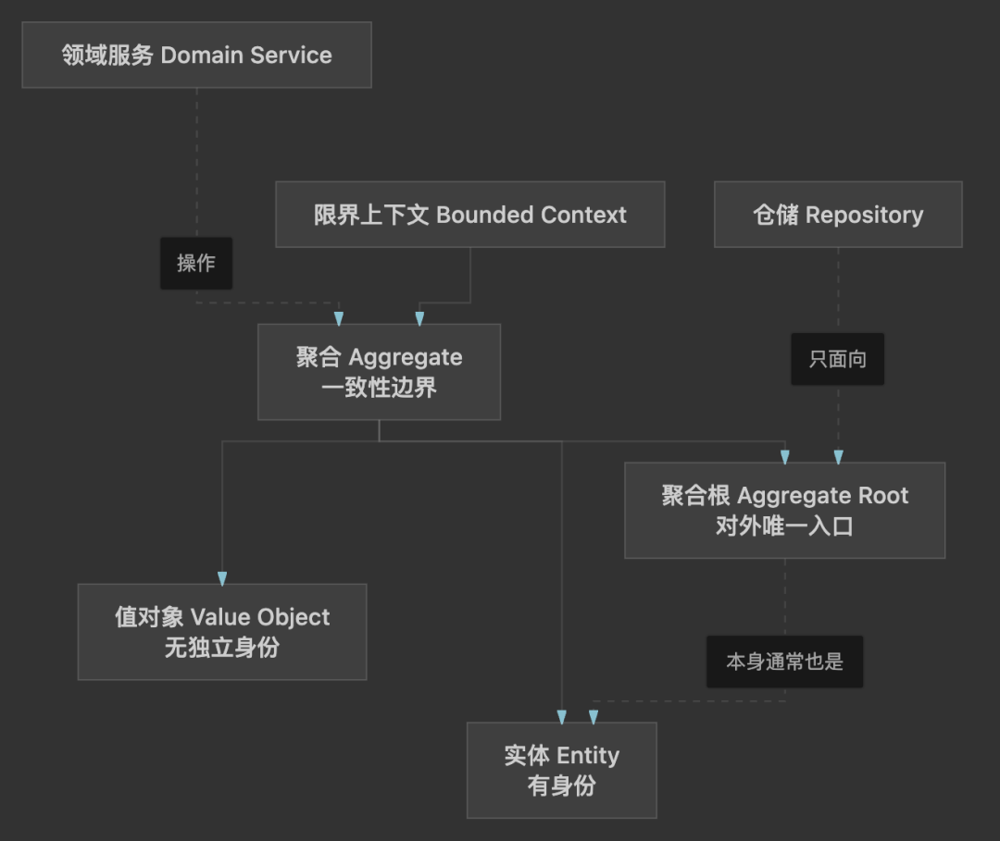
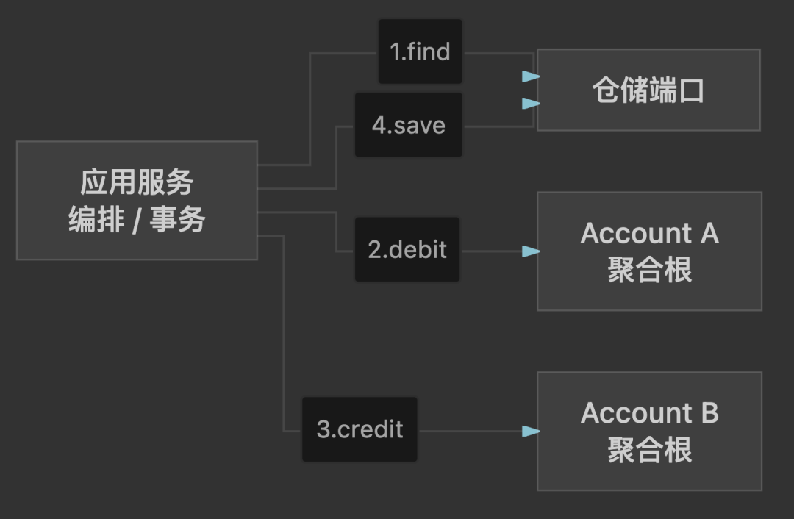
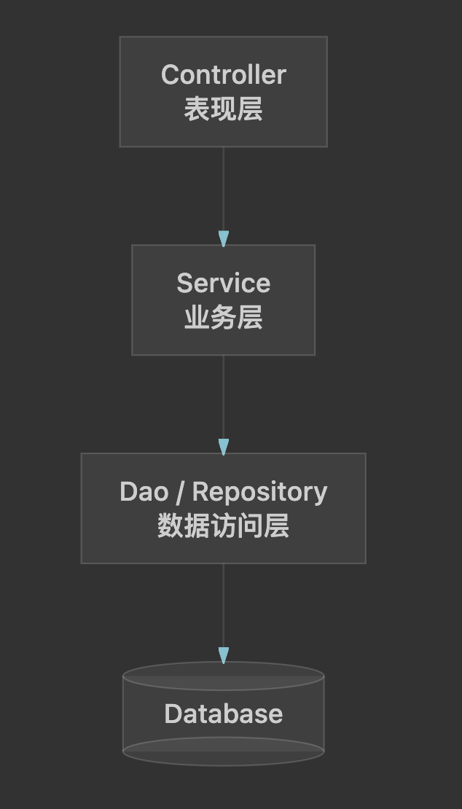
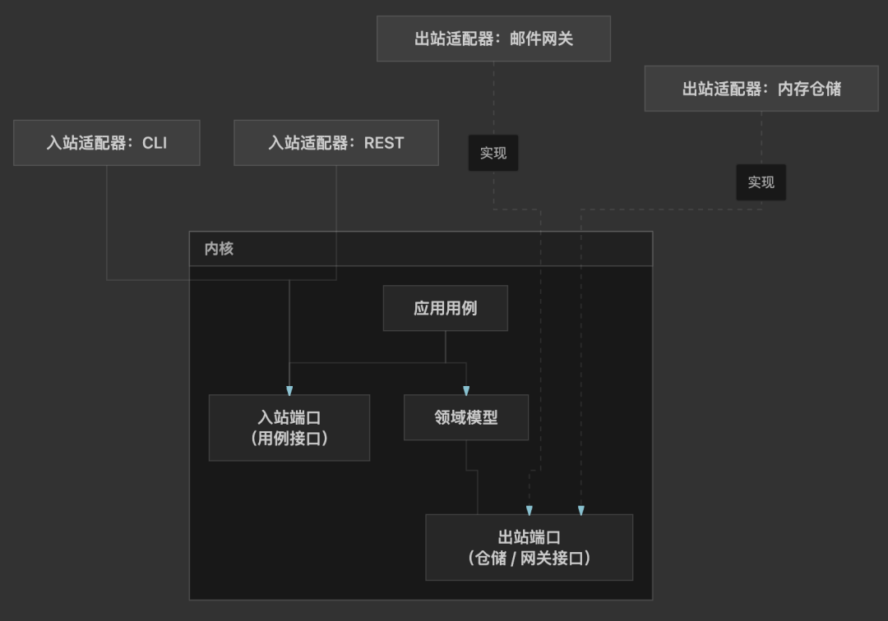
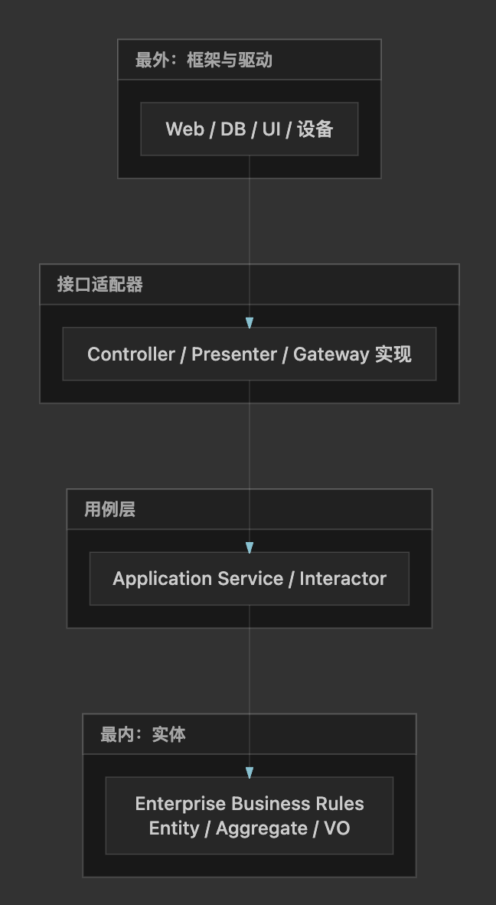
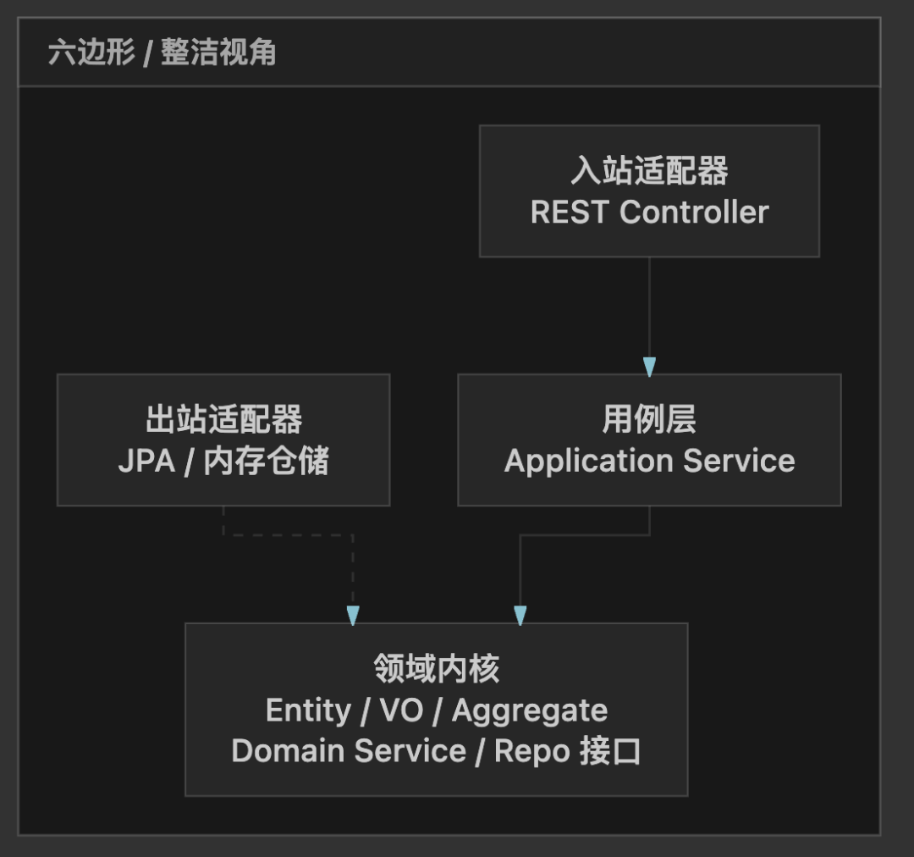
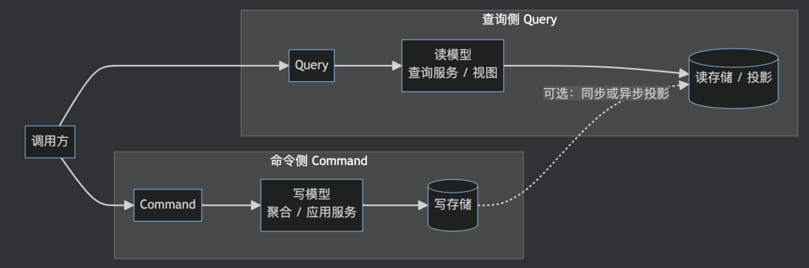
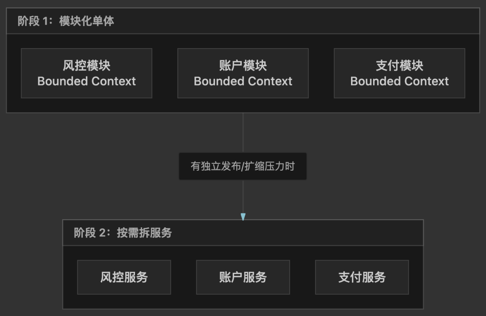

https://mp.weixin.qq.com/s/4QKgCSuPE3NR_38yCJcu4g

# DDD 概念与架构 —— 从分层到六边形/整洁

# DDD 概念与架构 —— 从分层到六边形 / 整洁

面向已有传统三层（Controller / Service / Dao）经验、希望系统理解领域驱动设计（DDD）与常见「内向依赖」架构的后端开发者。读完本文，你应能说清：为什么要做 DDD、战略/战术分别管什么、六边形与整洁架构如何约束依赖，以及它们和微服务边界的关系。落地代码见同系列实战篇。

## 1. 为什么需要 DDD

### 1.1 三层架构擅长什么

经典分层把系统切成表现层、业务层、数据访问层，好处很直观：

- 技术职责清晰：HTTP、事务、SQL 各有去处
- 新人上手快：按层找类，CRUD 流水线明确
- 与多数框架默认模板契合（尤其 Spring）

对**规则简单、以增删改查为主**的系统，三层往往够用。

### 1.2 它卡在哪里

业务变复杂后，常见症状会集中出现：

症状典型表现Service 膨胀一个 ```
XxxService
```

 里堆满 if-else，跨表流程、校验、发消息全挤在一起规则散落「余额不能为负」既在 Service 写一遍，又在前端/SQL 再写一遍，改一处漏一处模型贫血实体只有 getter/setter，行为全在 Service；领域知识漂在过程式代码里技术渗透业务Service 直接依赖具体 ORM、MQ SDK；换存储或加接口时牵一发动全身边界模糊按「技术层」切模块，而不是按「业务能力」；改支付会碰到账户、订单、库存的纠缠根因通常不是「分层错了」，而是：**技术分层解决的是代码放哪，没有解决业务边界与一致性边界该怎么划。**

### 1.3 DDD 要解决什么

DDD（Domain-Driven Design）强调：用**领域模型**表达业务，让代码结构追随业务结构。

它优先服务这类场景：

- 业务规则多、会演化，而不是一次性 CRUD
- 团队需要与业务方对齐「同一套语言」
- 系统需要在长期演进中保持可理解、可测试、可替换基础设施

它**不是**：

- 给每个项目镀金的银弹
- 必须上微服务才能用
- 必须上 Event Sourcing / 完整 CQRS 才叫 DDD

简单说：**复杂在领域时用 DDD 管理复杂度；简单在数据表时别过度设计。**

## 2. 战略设计：先画地图，再砌砖

战略设计回答：系统按业务怎么切开、团队用什么语言沟通、哪里值得投入建模。

### 2.1 通用语言（Ubiquitous Language）

业务专家说「冻结账户」，开发却写 ```
status=2
```

；业务说「挂起订单」，代码叫 ```
pauseOrder
```

——沟通成本会指数上升。

通用语言要求：在**同一个限界上下文内**，文档、对话、代码命名尽量一致。账户上下文里就叫 ```
Account
```

、```
freeze
```

、```
debit
```

，而不是一堆与业务无关的技术黑话。

### 2.2 限界上下文（Bounded Context）

限界上下文是模型的适用范围：同一词在不同上下文含义可以不同。

银行域里常见切分（示意）：

上下文「账户」大致指什么账户核心余额、冻结、记账不变式支付支付单、渠道、回调状态风控风险评分、限额、黑名单强行做一个巨大的 ```
Account
```

「上帝模型」覆盖所有含义，往往比拆开更糟。

### 2.3 上下文映射（简要）

上下文之间怎么协作，可用映射关系描述（不必一次记全，先抓住常用几种）：

关系含义（直觉）合作（Partnership）两边一起演进，模型需同步协调客户–供应商下游依赖上游；上游需考虑下游诉求防腐层（ACL）下游用适配层翻译上游模型，避免污染自己的领域开放主机服务上游提供稳定协议供多方集成各行其道几乎不集成，或仅弱依赖上表是常用子集，并非完整清单；Evans 还定义了 **Shared Kernel（共享内核）**、**Conformist（遵奉者）**、**Published Language（发布语言）** 等。其中 Partnership 等术语在 Evans 后续的 *DDD Reference* 中相对 2003 原著有所增补。

实战里最常落地的是：**明确谁拥有数据 + 需要时用防腐层隔离外部模型。**

### 2.4 子域分类：投入力度不同

类型特征建模投入核心域差异化竞争力所在高：认真建充血模型支撑域必要但非差异化中：够用即可通用域可采购/可复用（如认证、短信）低：买或用成熟组件Core Domain / Generic Subdomain 来自 Evans；把 **Supporting Subdomain（支撑域）** 与二者并列成三分法，主要来自 Vernon《Implementing Domain-Driven Design》。分类还随组织战略而变：同一能力对 A 公司可能是通用域，对 B 公司却是核心域。

战略设计的价值之一，是避免在通用域上「炫技式 DDD」，而在核心域上却仍是大泥球。

## 3. 战术设计：领域里的积木

战术设计回答：在一个限界上下文内，模型如何表达规则与一致性。

### 3.1 实体（Entity）与值对象（Value Object）

- **实体**：有稳定身份（Identity）。同一个账户 ID，余额怎么变仍是「这个账户」。
- **值对象**：通常无概念身份，由属性描述并按属性相等；Evans/Vernon 主张将其建模为**不可变**（变更时整体替换）。金额 ```
Money(100.00)
```

、封装后的 ```
AccountId
```

 都是典型例子。若概念上无法保持不可变，往往说明应建模为实体。

经验：能做成值对象的，优先值对象——减少「到处 set 字段」带来的非法状态。

### 3.2 聚合与聚合根（Aggregate / Aggregate Root）

聚合是一组对象及其边界，在**单次事务内**同步维护不变式；**聚合根**是外部**持久引用**与不变式守护的入口（外部不应长期持有内部成员引用；根可在单次操作中临时传递内部引用）。

关键约束：

1. **不变式在边界内维护**（例如单账户余额不得为负）
2. **一次事务通常只修改一个聚合实例**（Vernon 的经验法则 / rule of thumb）。跨聚合优先用领域事件等**最终一致**；应用服务可编排流程，但默认**不要**在同一数据库事务里改多个聚合根——仅在确有理由的例外场景打破。教学示例里「同进程先后 debit/credit」便于演示编排，生产上仍应按一致性边界设计事务。
3. 外部不能绕过聚合根直接改内部对象

账户示例里：```
Account
```

 是聚合根，余额变更只通过 ```
deposit
```

 / ```
debit
```

 / ```
credit
```

 等方法，而不是 ```
setBalance
```

。

战术概念之间的包含关系可以这样理解：



要点：外部通过**聚合根**进入聚合；仓储只为**需要全局直接访问**的聚合根提供（Evans）；领域服务处理「不属于单一实体」的领域规则。

### 3.3 领域服务 vs 应用服务


领域服务（Domain Service）应用服务（Application Service）放什么属于领域、但不自然属于某个实体/值对象的规则用例编排：加载聚合、调用领域行为、持久化、开事务依赖尽量只依赖领域概念可依赖仓储端口、事务、ACL 等例子「汇率换算策略」（若不属于 Account）「转账」：加载 A/B → debit → credit → save跨两个账户的转账，**钱怎么扣、怎么加**是账户聚合的行为；**先加载谁、事务怎么包、失败怎么回滚**是应用服务的职责。不必把流程硬塞进某一个 ```
Account
```

 里变成「上帝账户」。



### 3.4 仓储（Repository）

仓储提供「像集合一样」获取/保存聚合的抽象：

- **接口**定义在领域侧（或至少面向领域）
- **实现**放在基础设施（内存、JPA、MyBatis……）

这样领域与用例不绑定具体数据库，测试可用内存实现替换。

### 3.5 工厂与领域事件（概念级）

- **工厂**：当创建聚合的规则复杂（多步校验、多种起始状态）时，用工厂表达「如何合法出生」，避免构造函数爆炸。
- **领域事件**：聚合内发生了业务上值得对外告知的事实（如 ```
AccountDebited
```

）。可用于解耦后续动作（通知、投影、其他上下文），但不是入门必选项。

### 3.6 贫血模型 vs 充血模型

```
贫血：Account { id, balance, getters/setters }      AccountService.transfer(...) 里写全部规则充血：Account.debit(...) / Account.credit(...) 维护不变式      ApplicationService 只做编排与持久化
```

贫血并非「道德错误」——CRUD 报表可以很合适。一旦规则成为复杂度来源，充血模型能把规则收拢到可测试的领域对象中，避免 Service 变成流程垃圾桶。

## 4. 架构图景：分层、六边形、整洁

DDD 战术元素需要放进一种**依赖方向正确**的物理结构里。常见三种说法经常一起出现。

### 4.1 分层架构及其腐化

典型依赖：Controller → Service → Dao → DB。



腐化路径包括：

- Controller 直接调 Dao
- Service 泄漏 HTTP/会话细节
- 领域对象被持久化结构牵着走，退化成「表结构的数据容器」（Evans/Fowler 批评的贫血化风险；不等于禁止使用关系库或做映射）
- 「工具类」被各层随意引用，形成隐式全局依赖

分层本身没错；缺的是**明确的业务内核与依赖规则**。

### 4.2 六边形架构（端口与适配器）

把系统看成六边形：

- **内部**：领域模型 + 应用用例
- **端口（Port）**：内部对外的接口（入站用例接口、出站仓储/网关接口）
- **适配器（Adapter）**：把外部世界适配到端口（REST、CLI、消息；JPA、内存库、第三方 HTTP）

依赖方向：**源码依赖向内**——核心定义端口（Port）抽象；适配器在外实现或调用端口；核心**不依赖具体适配器技术**（REST、某 ORM、某 MQ SDK）。



对 Spring 项目而言：领域类保持 POJO；```
@RestController
```

、具体 ```
@Repository
```

 实现都算适配器或基础设施。

### 4.3 整洁架构 / 洋葱架构

整洁架构用同心圆表达同样思想：

- 最内：实体（企业业务规则）
- 外一圈：用例（应用业务规则）
- 再外：接口适配器
- 最外：框架与驱动（Web、DB、UI）

**依赖规则：源代码依赖只能向内指。** 内层不知道外层存在；外层实现内层定义的接口。



洋葱架构与之高度同构，只是圆圈命名习惯不同。

### 4.4 三者关系与 DDD 落点

可以粗略记：

> **Hexagonal（Cockburn）、Onion（Palermo）、Clean Architecture（Martin）共享「源码依赖向内」这条核心纪律，但历史演进、分层命名与细节不同——相似而非等同。** Clean 常被看作对前几者的综合；Hexagonal 更强调 ports/adapters，Onion/Clean 更强调同心分层。DDD 则提供「圆里面放什么业务积木」。

DDD 元素大致落点Entity / Value Object / Aggregate最内层（领域模型）Domain Service领域层Repository 接口 / 出站端口领域或应用边界向外看的端口Application Service（用例）应用层 / 用例层REST Controller入站适配器JPA / 内存仓储实现出站适配器Spring 配置、安全框架最外圈框架把上表画成「落点」示意：



判断标准不是包名是否时髦，而是：**改数据库时，领域测试是否几乎不用改。**

## 5. CQRS 简述

**CQRS（Command Query Responsibility Segregation）** 指：把**改变状态的命令（Command）**与**返回数据的查询（Query）**在模型或链路上分离。

一句话：

> 写模型专注不变式与业务决策；读模型专注查询效率与展示形状。二者不必强行共用同一个对象图。

基本形态：



动机很具体：当同一个「充血写模型」既要扛复杂规则，又要扛多样报表查询时，模型会左右为难——CQRS 承认这两种张力，允许读写分道。

入门阶段记住概念即可：**不必一上来就上消息总线、同步投影框架。** 很多系统先做到「写走应用服务+聚合，读用单独查询方法或只读视图」，就已经吃到分离的好处。更深的投影策略、最终一致读模型，留给真正有性能/模型冲突时再上。Fowler 也提醒：多数 CRUD 系统不必默认上 CQRS，应局部、谨慎使用。

## 6. DDD 与微服务边界

### 6.1 限界上下文 ≠ 立刻等于一个服务

限界上下文是**模型边界**；微服务是**部署与运行边界**。二者常相关，但不是自动划等号。

更稳妥的路径往往是：

1. 先在模块化单体中划清上下文与包边界
2. 明确数据所有权与集成方式
3. 有独立扩缩、独立发布、团队分裂等真实压力时再拆服务

过早按「每个名词一个服务」拆分，容易得到分布式大泥球。



限界上下文先在进程内划清；微服务是部署选择，不是建模的第一步。

### 6.2 什么时候考虑拆

常见信号：

- 通用语言已经明显分裂，硬揉一个模型成本更高
- 发布节奏、扩缩容需求显著不同
- 数据所有权清晰，且跨边界可以接受异步或明确的同步契约
- 团队组织与上下文大致对齐（康威定律）

### 6.3 跨上下文怎么协作

- **领域事件**：上下文 A 发生事实，B 订阅后更新自己的模型
- **开放 API + ACL**：调用方用防腐层翻译，避免「对方的表结构」渗进自己领域
- **避免**：多个服务通过**共享可写 schema/表**做集成（shared database anti-pattern）。问题在共享可写数据模型，而不只是「是否同一台数据库服务器」。

## 7. 落地原则与下篇预告

把前文收成可检查的原则：

1. **依赖向内**：领域不依赖框架与适配器细节
2. **聚合守不变式**：非法状态在领域方法内直接拒绝
3. **应用服务做编排**：跨聚合流程放用例层，不制造上帝聚合
4. **仓储端口可替换**：测试用内存实现，生产可换真实存储
5. **先边界后微服务**：上下文清晰优于服务数量
6. **CQRS 按需**：先理解读写分离动机，再决定是否上重型基础设施

下一篇将用 **Java + Spring Boot** 实现一个可运行的**账户转账**示例：从贫血分层基线出发，落到六边形包结构与充血聚合，配套内存仓储与测试。


---
*Source: [WeChat Article](https://mp.weixin.qq.com/s/4QKgCSuPE3NR_38yCJcu4g)*