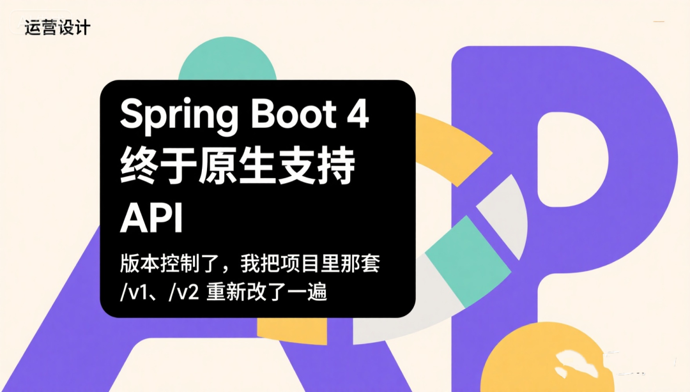

https://mp.weixin.qq.com/s/c_bGmCQ6ear4lTmOV3EMLw

# Spring Boot 4 终于原生支持 API 版本控制了，我把项目里那套 -v1、-v2 重新改了一遍



最近整理 Spring Boot 4 项目的时候，我发现了一个以前没太注意的变化：Spring Framework 7 已经把 API Versioning 正式做进 Spring MVC 了。

这个功能第一次看并不会觉得多惊艳，毕竟 API 版本控制我们很多年前就在做。项目里最常见的方案无非是在 URL 上加 /v1、/v2，或者从 Header 里读取版本号，再决定走哪套逻辑。

但也正因为以前 Spring 没有真正帮我们管这件事，一个项目维护几年以后，版本兼容代码经常会散得到处都是。

我们之前一个订单接口就是典型例子。

第一版上线的时候接口很正常：

- 
- 
- 
- 
- 
- 
- 
- 
- 
- 
- 
- 
- 
- 
- 
- 
- 
- 
- 
- 
- 
- 

```
@RestController@RequestMapping(”/api/v1/orders”)@RequiredArgsConstructorpublic class OrderV1Controller {     private final OrderService orderService;     @GetMapping(”/{orderId}”)    public OrderVO getOrder(            @PathVariable Long orderId) {         Order order =                orderService.getOrder(orderId);         return new OrderVO(                order.getId(),                order.getOrderNo(),                order.getAmount(),                order.getStatus()        );    }}
```

后来 App 做了一次比较大的改版，订单详情页增加优惠金额、实际支付金额、物流状态，同时原来的 status 也不够用了，需要把订单状态拆得更细。

老版本 App 已经发出去，不可能要求所有用户当天升级，所以我们只能继续保留 /v1，然后新增 /v2。

代码很快就变成：

- 
- 
- 
- 
- 
- 
- 
- 
- 
- 
- 
- 
- 
- 
- 
- 
- 
- 
- 
- 
- 
- 
- 
- 
- 
- 
- 

```
@RestController@RequestMapping(”/api/v2/orders”)@RequiredArgsConstructorpublic class OrderV2Controller {     private final OrderService orderService;     @GetMapping(”/{orderId}”)    public OrderV2VO getOrder(            @PathVariable Long orderId) {         OrderDetail detail =                orderService.getOrderDetail(                        orderId                );         return new OrderV2VO(                detail.getId(),                detail.getOrderNo(),                detail.getOriginalAmount(),                detail.getDiscountAmount(),                detail.getPayAmount(),                detail.getOrderStatus(),                detail.getLogisticsStatus()        );    }}
```

这种方案刚开始其实挺清楚。

看 URL 就知道版本：

- 
- 
- 

```
/api/v1/orders/10001 /api/v2/orders/10001
```

问题一般不是出在第二个版本，而是第三个、第四个版本出来以后。

订单下面不只有查询详情，还有取消订单、确认收货、查询物流、申请售后。用户中心、商品、优惠券也开始出现自己的 V1、V2。

项目最后慢慢变成：

- 
- 
- 
- 
- 
- 
- 
- 
- 
- 
- 
- 
- 
- 
- 
- 

```
controller├── v1│   ├── OrderController│   ├── ProductController│   ├── MemberController│   └── CouponController│├── v2│   ├── OrderController│   ├── ProductController│   ├── MemberController│   └── CouponController│└── v3    ├── OrderController    └── ProductController
```

最麻烦的是，其实 V2 并没有把所有接口都改掉。

比如订单查询变了，但取消订单没有变；商品详情变了，但商品收藏没有变。为了保持整个 /v2 路径完整，有时候还是会复制一份 Controller，或者想办法让 V2 Controller 继承、调用 V1。

代码开始出现这种东西：

- 
- 
- 
- 
- 
- 
- 
- 

```
@GetMapping(”/{orderId}/logistics”)public LogisticsVO logistics(        @PathVariable Long orderId) {     return orderService.queryLogistics(            orderId    );}
```

V1 有一份。

V2 其实逻辑完全一样，但为了 URL 还是又有一份。

时间长了以后，真正需要版本管理的明明只是少数几个接口，Controller 却按照版本整体复制了。

这次升级 Spring Boot 4 后，我尝试把这一层拿掉。

Spring MVC 现在可以直接配置 API 版本从哪里读取。我们最终没有继续把版本放在 URL 里，而是改成 Header：

- 
- 
- 
- 
- 
- 

```
spring:  mvc:    apiversion:      use:        header: X-API-Version      default: 1.0
```

以后请求地址不再变化：

- 

```
GET /api/orders/10001
```

V1 客户端发送：

- 

```
X-API-Version: 1.0
```

V2 客户端发送：

- 

```
X-API-Version: 2.0
```

然后 Controller 可以直接在 @GetMapping 上声明版本。

订单查询最后改成了这样：

- 
- 
- 
- 
- 
- 
- 
- 
- 
- 
- 
- 
- 
- 
- 
- 
- 
- 
- 
- 
- 
- 
- 
- 
- 
- 
- 
- 
- 
- 
- 
- 
- 
- 
- 
- 
- 
- 
- 
- 
- 
- 
- 
- 
- 
- 
- 
- 

```
@RestController@RequestMapping(”/api/orders”)@RequiredArgsConstructorpublic class OrderController {     private final OrderService orderService;     @GetMapping(            value = ”/{orderId}”,            version = ”1.0”    )    public OrderV1VO getOrderV1(            @PathVariable Long orderId) {         Order order =                orderService.getOrder(orderId);         return new OrderV1VO(                order.getId(),                order.getOrderNo(),                order.getAmount(),                order.getStatus()        );    }     @GetMapping(            value = ”/{orderId}”,            version = ”2.0”    )    public OrderV2VO getOrderV2(            @PathVariable Long orderId) {         OrderDetail detail =                orderService.getOrderDetail(                        orderId                );         return new OrderV2VO(                detail.getId(),                detail.getOrderNo(),                detail.getOriginalAmount(),                detail.getDiscountAmount(),                detail.getPayAmount(),                detail.getOrderStatus(),                detail.getLogisticsStatus()        );    }}
```

地址完全一样：

- 

```
/api/orders/10001
```

Spring 根据请求携带的 API Version，决定最终调用哪个方法。

这样改以后，我觉得最明显的变化并不是少了 /v1、/v2 这几个字符，而是接口版本终于从“Controller 目录结构”变成了“请求映射的一部分”。

尤其一些根本没有发生变化的接口，不再需要复制。

例如订单物流查询从 V1 到 V2 完全没有变化，那就只保留一个：

- 
- 
- 
- 
- 
- 
- 
- 

```
@GetMapping(”/{orderId}/logistics”)public LogisticsVO getLogistics(        @PathVariable Long orderId) {     return orderService.queryLogistics(            orderId    );}
```

这个方法没有指定 version，可以作为未发生版本分化的处理方法存在。当出现一个带明确版本的更具体映射时，Spring 会优先选择对应版本。

这正好解决了我们以前最别扭的地方。

并不是发布 V2 以后，整个 API 都突然变成了 V2。现实情况通常是某几个接口发生变化，其他几十个接口根本没有动。以前按照 /v1、/v2 整套复制 Controller，本质上把“应用版本”和“单个接口版本”绑得太死。

现在可以只对真正变化的方法做版本区分。

当然，我这里有一个原则没有改：虽然两个版本可以放在同一个 Controller，但 DTO 不要为了省事继续共用。

比如第一版：

- 
- 
- 
- 
- 
- 
- 

```
public record OrderV1VO(        Long id,        String orderNo,        BigDecimal amount,        String status) {}
```

第二版：

- 
- 
- 
- 
- 
- 
- 
- 
- 
- 

```
public record OrderV2VO(        Long id,        String orderNo,        BigDecimal originalAmount,        BigDecimal discountAmount,        BigDecimal payAmount,        String orderStatus,        String logisticsStatus) {}
```

以前我也干过另外一种事情，为了不建新的 VO，直接在老对象上不断加字段：

- 
- 
- 
- 
- 
- 
- 
- 
- 
- 
- 
- 
- 
- 
- 
- 
- 

```
public class OrderVO {     private Long id;     private String orderNo;     private BigDecimal amount;     // V2 新增    private BigDecimal discountAmount;     // V2 新增    private BigDecimal payAmount;     // V2 新增    private String logisticsStatus;}
```

然后希望老客户端“忽略它不认识的字段”。

短时间确实能用，但版本继续往后走以后会越来越麻烦。尤其字段类型变化、字段语义发生变化的时候，一个 DTO 同时服务三四个 API 版本，最后代码里很难判断一个字段到底还能不能删。

所以我现在宁愿把版本差异明确留在接口边界。

Service 层反而尽量不要跟版本走。

比如：

- 
- 
- 
- 
- 
- 
- 
- 
- 
- 
- 
- 
- 
- 
- 
- 
- 
- 
- 
- 
- 
- 
- 
- 
- 
- 
- 
- 
- 
- 
- 
- 
- 
- 
- 
- 
- 
- 
- 
- 
- 
- 
- 
- 
- 
- 
- 
- 
- 

```
@Service@RequiredArgsConstructorpublic class OrderService {     private final OrderRepository orderRepository;    private final LogisticsService logisticsService;    private final PromotionService promotionService;     public OrderDetail getOrderDetail(            Long orderId) {         Order order =                orderRepository                        .findById(orderId)                        .orElseThrow(                                OrderNotFoundException::new                        );         PromotionInfo promotion =                promotionService.query(                        orderId                );         LogisticsInfo logistics =                logisticsService.query(                        orderId                );         return OrderDetail.builder()                .id(order.getId())                .orderNo(order.getOrderNo())                .originalAmount(                        order.getOriginalAmount()                )                .discountAmount(                        promotion.discountAmount()                )                .payAmount(                        order.getPayAmount()                )                .orderStatus(                        order.getStatus()                )                .logisticsStatus(                        logistics.status()                )                .build();    }}
```

Controller 负责把同一份领域数据转换成不同版本需要的响应。

V1：

- 
- 
- 
- 
- 
- 
- 
- 
- 
- 
- 
- 

```
private OrderV1VO toV1(        OrderDetail detail) {     return new OrderV1VO(            detail.getId(),            detail.getOrderNo(),            detail.getPayAmount(),            convertOldStatus(                    detail.getOrderStatus()            )    );}
```

V2：

- 
- 
- 
- 
- 
- 
- 
- 
- 
- 
- 
- 
- 

```
private OrderV2VO toV2(        OrderDetail detail) {     return new OrderV2VO(            detail.getId(),            detail.getOrderNo(),            detail.getOriginalAmount(),            detail.getDiscountAmount(),            detail.getPayAmount(),            detail.getOrderStatus(),            detail.getLogisticsStatus()    );}
```

我不太建议写：

- 
- 
- 
- 
- 

```
OrderV1Service OrderV2Service OrderV3Service
```

除非两个版本的业务规则真的已经不同。

很多 API Version 的变化，其实只是接口契约变了，并不意味着底层订单业务也出现了三个版本。如果 Controller、Service、Mapper、Repository 全跟着 V1、V2 复制一遍，后面的维护成本会比 API 兼容本身还高。

这次改造里还有一个我觉得挺实用的功能，就是 Spring 的版本匹配不仅可以写固定版本。

除了：

- 
- 
- 
- 

```
@GetMapping(        value = ”/{orderId}”,        version = ”2.0”)
```

还可以写：

- 
- 
- 
- 

```
@GetMapping(        value = ”/{orderId}”,        version = ”2.0+”)
```

这个 + 一开始我没太在意，后来发现其实很适合一些向后兼容的小版本。

例如 2.0、2.1、2.2 的订单详情响应结构完全一样，只是客户端自身做了调整，那么没必要复制：

- 
- 
- 

```
2.02.12.2
```

三个 Controller 方法。

可以写成：

- 
- 
- 
- 
- 
- 
- 
- 
- 
- 
- 
- 

```
@GetMapping(        value = ”/{orderId}”,        version = ”2.0+”)public OrderV2VO getOrderV2(        @PathVariable Long orderId) {     return toV2(            orderService                    .getOrderDetail(orderId)    );}
```

等到 3.0 真正发生不兼容变化的时候，再单独加：

- 
- 
- 
- 
- 
- 
- 
- 
- 

```
@GetMapping(        value = ”/{orderId}”,        version = ”3.0”)public OrderV3VO getOrderV3(        @PathVariable Long orderId) {     // V3 返回结构}
```

Spring 在这里不是简单拿字符串做比较。默认版本会按照语义版本的方式解析，主版本、次版本、补丁版本都可以参与比较。

比如：

- 
- 
- 
- 

```
11.11.1.22.0
```

都属于正常版本表达方式。

这一块比我们以前自己从 Header 拿字符串然后写：

- 
- 
- 
- 
- 

```
if (”1”.equals(version)) {    ...} else if (”2”.equals(version)) {    ...}
```

明显舒服很多。

以前我们项目里真有过类似代码：

- 
- 
- 
- 
- 
- 
- 
- 
- 
- 
- 
- 
- 
- 
- 
- 
- 
- 
- 

```
String version =        request.getHeader(                ”X-API-Version”        ); if (StringUtils.isBlank(version)        || ”1”.equals(version)) {     return handleV1(request);} if (”2”.equals(version)) {     return handleV2(request);} throw new UnsupportedApiVersionException(        version);
```

后来版本号从：

- 
- 

```
12
```

变成：

- 
- 
- 

```
1.01.12.0
```

判断逻辑就开始越来越难看。

现在这层工作交回 Spring 以后，Controller 只需要声明：

- 

```
version = ”1.0”
```

业务代码不再关心版本到底从 Header、QueryString 还是 URL 哪个位置解析出来。

实际上 Spring Boot 4 并没有限制只能使用 Header。

如果公司原来的 API 就是：

- 

```
/api/v1/orders
```

也可以继续采用 URL Path Segment；如果以前约定的是：

- 

```
/api/orders?version=2
```

也可以从 Query Parameter 获取。

我最后选择 Header，主要是因为这个项目已经进入稳定期，我不想让每次 API 升级都改变资源 URL。

订单资源就是：

- 

```
/api/orders/10001
```

至于客户端使用哪一版契约，通过 Header 表达就够了。

但这只是我们项目的选择，并不是说 /v1 放在 URL 里就错了。如果 API 已经公开出去，而且大量第三方正在使用 /v1、/v2，为了换一个 Spring 新功能把 URL 全改掉，反而没有必要。

这次还有一个很现实的问题，就是老 App 怎么办。

线上肯定还有一些非常旧的客户端，它们根本不会发送：

- 

```
X-API-Version
```

如果升级后强制要求每个请求都必须带版本号，这批客户端当天就全挂了。

所以迁移阶段我加了默认版本：

- 
- 
- 
- 
- 
- 

```
spring:  mvc:    apiversion:      use:        header: X-API-Version      default: 1.0
```

旧客户端：

- 

```
GET /api/orders/10001
```

没有 Header，就继续按 1.0 处理。

新客户端：

- 
- 

```
GET /api/orders/10001X-API-Version: 2.0
```

直接进入 V2。

这给我们留出了一个很舒服的迁移窗口。等旧客户端比例降到可以接受以后，再决定要不要把 API Version 改成必须提供。

为了防止客户端随便传一个版本，我后来还把支持版本明确配置出来。

- 
- 
- 
- 
- 
- 
- 
- 
- 
- 
- 
- 

```
spring:  mvc:    apiversion:      use:        header: X-API-Version       default: 1.0       supported:        - 1.0        - 2.0        - 2.1
```

比如请求：

- 

```
X-API-Version: 9.9
```

不应该莫名其妙落到某个 Controller，而应该直接告诉调用方这个版本不支持。

这一点以前我们自己写拦截器的时候经常被忽略。很多项目只负责“读取版本”，但到底有哪些版本有效、未知版本怎么办、缺失版本怎么办，往往分散在不同代码里。

Spring 现在把版本解析、校验和 Handler Mapping 放到了一套机制里以后，这块至少不会再需要每个项目重新造一次轮子。

写到这里，我顺手又把昨天刚改完的 @HttpExchange Client 拿过来试了一下。

这两个功能放在一起其实还挺顺。

比如订单服务要调用新的用户中心 API：

- 
- 
- 
- 
- 
- 
- 
- 
- 
- 
- 

```
@HttpExchange(”/api/users”)public interface UserClient {     @GetExchange(            value = ”/{userId}”,            version = ”2.0”    )    UserDTO getUser(            @PathVariable Long userId    );}
```

Server 端可以按 API Version 路由，HTTP Interface Client 同样可以声明自己调用哪个版本。

如果直接使用 RestClient，也可以把版本插入方式统一配置起来，而不是每个请求手写：

- 
- 
- 
- 

```
.header(        ”X-API-Version”,        ”2.0”)
```

这也是我最近连续看 Spring Boot 4 这些变化时比较明显的感觉。

单独看 @HttpExchange，只是少写一些 HTTP Client 代码；单独看 API Versioning，也只是少写一点版本判断。但这些基础能力陆续进入 Spring Framework 自己以后，一些我们以前默认依赖第三方库或者公司基础框架才能解决的问题，开始可以直接用 Spring 本身完成。

当然，我还是没有因为这个功能把所有 /v1、/v2 Controller 一次性删掉。

现在项目里采用的还是渐进迁移。

旧接口如果已经稳定，而且基本不会再改，就继续保留。真正需要开发 V2、V3 的接口，才逐步迁到新的 API Versioning 上。

我也没有把所有版本方法全部堆进一个几千行的 Controller。

如果某个接口 V1 和 V2 只是 DTO 不同，放在一起很清楚：

- 
- 
- 
- 
- 
- 
- 
- 
- 
- 
- 

```
@GetMapping(        value = ”/{id}”,        version = ”1.0”)... @GetMapping(        value = ”/{id}”,        version = ”2.0”)...
```

但如果 V3 已经是完全不同的一套业务流程，我还是会拆 Controller 或者拆 Facade。

框架提供的是版本路由，不代表我们应该为了“看起来统一”把所有历史代码都挤在同一个类里。

这次改完以后，我最大的感受其实跟昨天换 @HttpExchange 差不多。

Spring Boot 4 里很多变化并不是那种用了以后性能翻倍的新技术，而是在把 Java Web 项目里大家已经重复做了很多年的基础工作逐渐收回来。

以前做 API Version，我们自己写路径、拦截器、Header 解析、版本判断和异常处理。

现在 Controller 可以很直接地写：

- 
- 
- 
- 

```
@GetMapping(        value = ”/orders/{id}”,        version = ”2.0”)
```

版本怎么从请求里拿、版本是否合法、最终应该匹配哪个 Handler，这些事情交给框架。

真正留给业务代码的，还是那个更重要的问题：

V2 相比 V1 到底改变了什么。

对于我来说，这才是这次改造最有价值的地方。

不是项目从此没有 /v1、/v2 了，而是以后再增加一个 API 版本时，我终于不用先复制一个 Controller 目录，然后再删除里面那几十个其实根本没有发生变化的方法。


---
*Source: [WeChat Article](https://mp.weixin.qq.com/s/c_bGmCQ6ear4lTmOV3EMLw)*