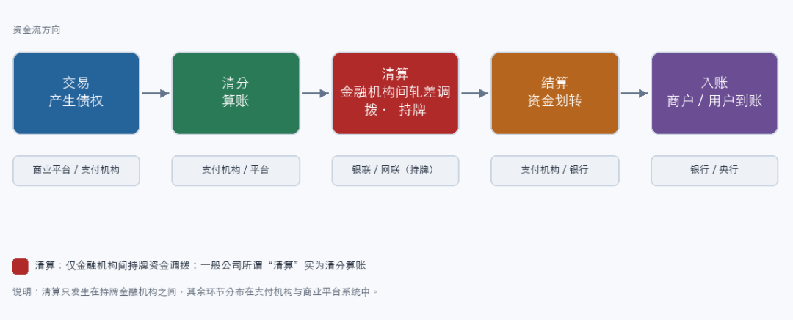
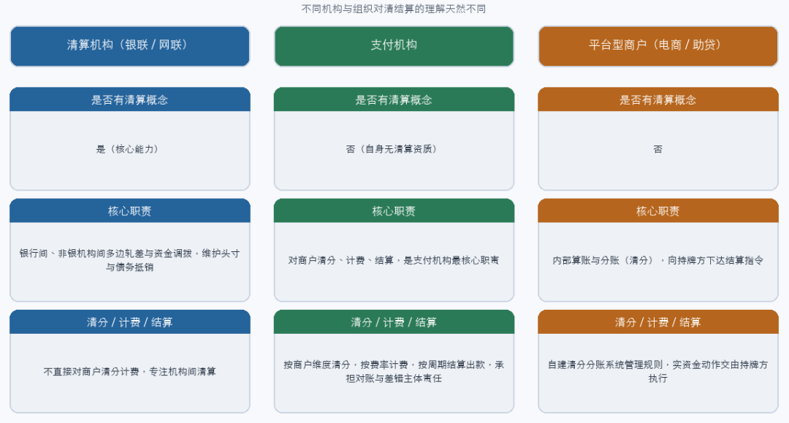
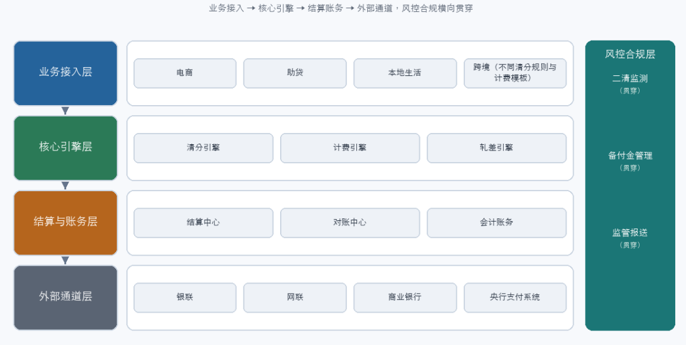
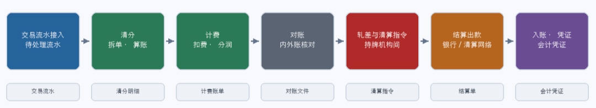
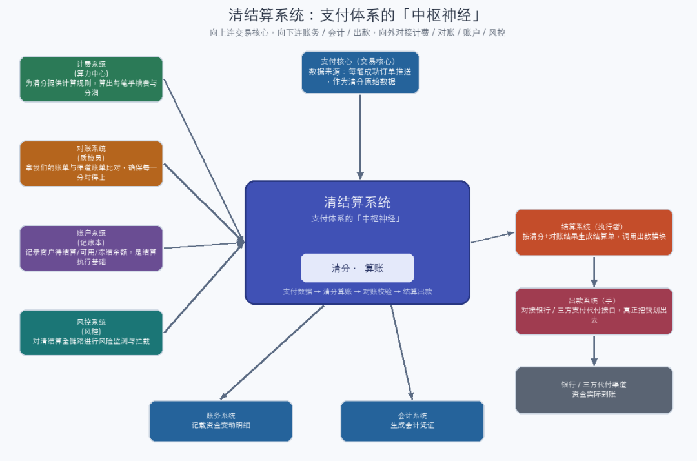
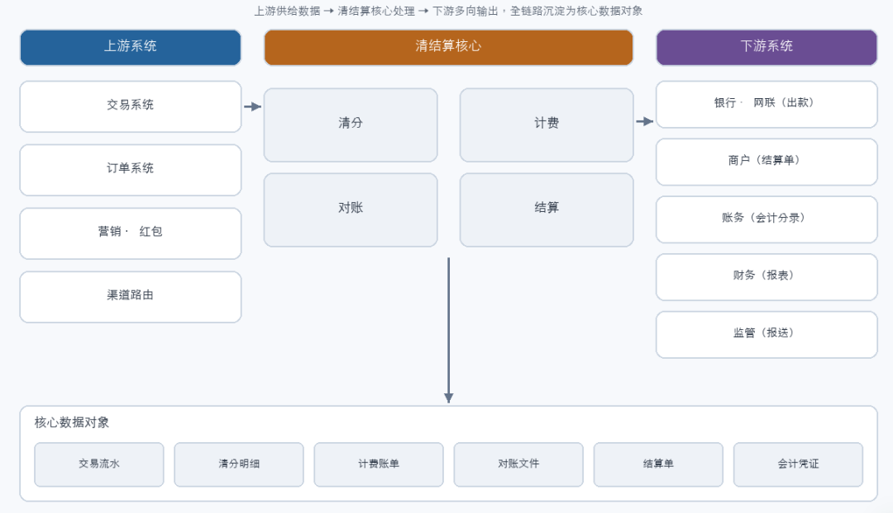

https://mp.weixin.qq.com/s/Ea_lD35SqBfLfzBjayL9hQ

# 一文看懂清结算模块设计：从业务需求和设计落地

“hello，我是彬彬，好久不见。断更期间有收到大家不少的催更需求，在这里对持续关注内容的粉丝大大们表示歉意，同时也真挚的感谢，对过往内容的认可。今天也宣告从本周开始正式恢复更新啦，恢复节奏可能还要在调整，但绝对会保持一段固定周期和频率的输出，再次致歉和感谢。至于之前为什么断更这么久，有时间单独出一篇吧，如果有人想看的话，哈哈。另外近期台风横行，持续时间很长，江浙沪的朋友们注意安全啊。”

接着之前支付产品设计系列的内容，支付结算整体的大模块，现在只剩下清结算了。所以，今天就来聊一聊清结算。

清结算其实不仅仅在支付系统或者支付产品中经常提到，几乎任何业务形态都会涉及到清结算，只要和资金相关。比如我们熟知的电商、本地生活、金融助贷等业务。

它不像是收银台那样直接面对用户，也不想营销那样特别容易被“感知（也可能是打扰）”，但它决定了每一笔资金能否准确、合规、及时的从债权债务转变成实际到账。

如果说支付系统整体就是一座冰山，收银台只是大家感知到的冰山上露出的一角，那清结算就是沉在最底层的最大那块冰层。很多支付或者交易的产品经理把精力放在交易转化率、支付成功率、收银台体验和渠道路由上，这当然重要。但如果理解始终停留在交易层，那对支付的认识就还是差了最后一截。真正拉开从业者段位的，恰恰是对清结算的理解深度与架构能力。

而且清结算其实是一个在不同机构的同学理解差异会非常大的一个模块，因为它是和业务模式最紧密关联的一个模块。

此篇个人主要从下面几个方面展开聊一聊，理解不同或者有不同见解欢迎沟通交流：

- 清结算的整体业务含义-讲清楚到底什么是清结算

- 清结算设计的核心框架、流程、产品架构等

- 最后也是比较容易忽略的其所涉及的完整环节、上下游联动和关键的数据

01

—

清结算的整体业务含义

理解清结算，首先我们要先明确它的边界：清结算处理的内容都是针对交易完成之后发生的事情。和账务系统还不太相同，账务在交易过程中的流转也是其要关心和感知的，但清结算在交易没有成功之前不会涉及到。

一笔用户的购买订单，在用户侧表现为下单、鉴权、扣款，这些动作在系统里产生的其实从财务语义上来说，是一笔债权债务的关系，你从电商平台买了一个商品，是商品的所有权从商家转移到你手里，相应的对平台而言，就会产生不同的债务归属，但这时候资金并不一定完成了真实的转移。真正让资金从付款方流向收款方，让各方债权归位的，才是清结算。

理解清结算，其次我们要厘清一些概念。比较重要或者有关联的概念我个人认为有以下几个：清算、清分、计费、结算、合约、对账。

其中清分、清算、结算三个概念经常被混着用，很多人也觉得是一回事。在不同行业和不同公司里，其实这是几个完全不同的环节，他们的含义和边界可以说完全不相同。

最容易混淆的是清算。严格意义上讲，清算是特指金融机构之间的资金调拨和轧差。银联、网联这类持牌清算机构，负责在银行和银行之间、银行与非银支付机构之间完成多变净额的计算，并发送给实际处理资金的机构（一般是人行或者商业银行的总行清算中心）资金调拨指令。

一笔交易从A银行到B银行，中间经过银联，银联计算A银行欠B银行多少钱，B银行又欠C银行多少钱，最后轧差出一个净额，在央行的清算账户里完成划拨。这才是金融学意义上的“清算”。

清算是需要持牌的金融业务，一般商业公司根本不具备清算资质，也不允许触碰这一层。所以大多数平台类公司，甚至支付机构的清结算核心处理的都是清分的事情。

清分，核心的逻辑是算账。它把交易系统产生的海量流水，按照业务规则进行拆分、归类、汇总，计算出每一方应收应付的金额。对大多数非金融机构而言，所谓清结算里的“清”，主要就是指清分这一层：把账算清楚，算到每一方、每一笔。

比如对于支付机构而言，类似支付宝、微信支付的商户服务端，它们对商户的“清结算”本质上是清分和结算的合体。它们算清楚商户该收多少钱，该扣多少手续费，然后把钱通过银行打给商户。它们没有在银行间调拨资金的权利，但它们是整个清结算链条中最核心的执行者和触发者。再比如对于电商平台、O2O平台这类“平台型商户”，它们内部所谓“清结算系统”，其实也没有清算的概念。核心做的就是算账和分账。算清楚要给商家多少钱，要给分销商多少佣金，要给外卖骑手多少佣金，再通过支付机构或银行发出指令，支付机构和银行再给银联、网联发送指令完成最终的资金划转。
计费，比较容易理解，就是计算相关的费用，可以简单理解成算清楚要收多少钱。一般的计费理解，特指当前平台主体对使用服务的一方或几方收取相应的费用。比如支付机构对特约商户的渠道手续费收取，电商平台/外卖平台等对商家收取的技术服务费等等。很多公司的处理上，计费和清分是一个模块，计费用于规则维护，清分执行具体规则计算，并且计费的模块设计也可能会包含合约的部分。因为详细的计费规则是来源于合约。
合约：不同公司可能叫法不同，这个特指对商户或者资金链条上的接收方事先约定的条款。会约定收取费用的规则，结算的规则比如周期、结算账户、结算方式。也可以理解成这是结算这一环所依赖的现实物理合同的线上精简版，只是对其中和结算相关的内容做了线上化和结构化处理。其本身不一定是在清结算域内，但是清结算需要联动使用的规则基础。
结算，是资金的真实划转动作，或者说债权债务真正的完结。其依据的就是清分或者清算的结果，通过央行支付系统或者银行的清算中心，将资金从付款方账户划转到收款方账户，完成所有权的转移。如上文所述，对平台性商户而言，结算往往表现为向支付机构或者银行发送指令，有持牌方完成最终的资金转移。当然，支付机构和银行现在提供的很多产品，也存在“虚拟户”这种方案，有可能对平台型商户而言已经完成了结算，对支付机构和银行而言只是记账，并没有真实的资金处理，只有当商户真实的提现之后才涉及到真实资金的流动，这个典型的就是二清类的方案，感兴趣的同学可以翻历史或者搜一搜相关公开内容。
对账：严谨来讲对账和清结算应该也算两个域，这里提到主要是因为清结算的前提，是对账一定要达到对平的程度，或者一定绝对值上的对平。
其实讲述完概念，一笔资金从业务链路角度上看需要经历的阶段已经比较清楚了。交易产生（产生了债权）-清分（算清楚账）-计费（需要收取的费用，自己不能亏钱对吧。这个部分也可以理解清分过程的一环）-清算（金融机构之间资金轧差调拨）-结算（资金真实划转）-入账给相应商户（商户或用户到余额或银行卡）。其中清算只发生在持牌金融机构之间，其余环节分布在支付机构和平台商户的系统中。这条链路算是建立起了清结算整条资金链路上所有环节和角色的骨架。

图1_清结算整体业务链路
所以在不同公司和机构的从业人员，对清结算业务的理解也差异很大。当我们再听到“清算”这个词，可以先想想说话的人是谁。如果是银联网联的人，那是在说金融机构间的资金调度。如果是支付机构的人，那是在说对商户的计费和结算。如果是一个互联网公司的人，那大概率是在说算账和对账。

02

—

清结算设计的核心框架和产品架构

清结算我个人认为是最难的模块，之所以难，是因为它是整个支付结算系统中最业务化的模块。收银台、路由、渠道对接这些环节可以提炼出相对标准化的流程和设计，而清结算必须跟随业务形态走。
不同的业务形态，意味着不同的业务流程、不同的清分对象、不同的计费方式；而交易和账务虽然也和业务有很大关系，也是基于业务模式进行抽象，但抽象出来的模型和设计是有可能可以套用在其他业务场景和模式上的。
以电商平台和助贷平台为例，二者的清结算设计差异就极大。电商平台的清结算对象主要是平台自身、入驻商户与分销商：平台按交易额抽取类目佣金，商户按净销售额结算，分销商按分销比例获得分成，其计费模型围绕商品、订单、佣金等展开。而助贷平台的清结算对象则是资方、助贷机构和担保机构：放款环节资金从资方流出，助贷机构按撮合服务费分润，担保机构按担保费率计提，还款环节还要处理本金、利息、罚息在多方之间的清分。两个场景的清分规则、计费维度和结算周期几乎不能通用，这正是“最业务化”的直观体现。
甚至再进一步，即便同属电商，自营电商与平台电商的清分对象也不同；同属助贷，纯撮合与担保代偿模式的计费链路也不同。业务形态的颗粒度，直接决定了清分规则的颗粒度。这也是为什么清结算团队必须深度理解业务，而不能只是把自己当作一个通用的算账工具。
举个具体例子便于理解差异。一笔一千元的电商订单，若平台类目佣金率百分之一、分销比例百分之五，清分引擎会拆出：商户净结940元、平台佣金10元、分销商分成50元；计费引擎据此生成费用与分账账单；结算中心在T+1（当然也可能其他周期，比如T0）分别向商户与分销商出款，平台佣金留存。同样是一千元，若是助贷放款，清分对象则变成资方本金、利息、助贷服务费、担保费等，规则与入账路径就完全不同了，平台佣金那套逻辑在这里就不太用的上。
这种差异也决定了，不同机构和组织对清结算的理解天然不同。
清算机构，如银联、网联，关注的核心是银行间、非银金融机构间的资金轧差与清算，其职责是维护跨机构的多边净额计算与头寸调拨，并在自身账簿上完成机构间的债务抵销。
支付机构，关注的核心是对商户的结算、清分与计费，这是其最核心的职责。支付机构需要把来自交易的流水按商户维度清分，按签约费率计费，再按约定周期结算出款，同时承担对账与差错处理的主体责任。
平台型商户，如电商、助贷平台，自身并没有清算概念。对它们而言，清分就是算账与计费，结算给商户一般也是通过支付机构或银行下达指令来完成资金划转。但在系统模块定义上，平台确实会建设一套清分与分账系统，用于内部的计算与规则管理，只是最终的真实资金动作必须交由持牌方执行。
理解这三层视角的差异，是设计清结算产品的一个前提：我们服务的角色不同，要建设的“清算、清分、结算”能力边界就不同。

图2_多角色清结算职责对比

如果要设计一套清结算产品，我觉得需要同时回答六个问题：

- 业务形态如何适配
- 清分对象如何建模
- 计费模型如何定义
- 结算规则如何配置
- 对账与差错如何处理
- 合规持牌需要如何处理

这六个维度是缺一不可的，且彼此高度耦合。业务形态决定了清分对象，清分对象决定了计费模型，计费模型又约束结算规则，而所有动作都必须在合规范围内正常运行。

其实这六个问题可以拆开看，会更清晰一些：

- 业务形态适配解决的问题是“为谁算”，在企业内部可以是各种不同的业务形态，支持的是电商业务还是金融业务。
- 清分对象建模解决的问题是“算哪些参与方”，不同的业务模式下，有不同的参与方，可以分别针对业务形态建模。
- 计费模型解决的问题则是“按什么规则收和分”，是详细的规则维护和处理模块。
- 结算规则则是为了处理解决“什么时候、以什么节奏出款”，比如结算周期（T0、T1、月结、周结等），结算方式（余额、卡等），结算模式（自有资金结算、存管行模式等，取决于资金归集的类型，不一定通用）
- 对账与差错解决“算错了怎么办”，差异如何处理，每个差异原因细分类有没有标准处理方式，补单、调账、循环对账等
- 合规则是为了确保“哪些动作只能交给持牌方”，自己只做自己能力和职责范围内的事情

想清楚以上问题，清结算的整体架构和设计就比较清楚了。

另外是一个设计的原则，好的清结算架构，我认为还需要支持一下设计规范才能更好的支持业务。一是规则要与执行分离，让业务规则的变化不影响核心引擎的稳定。二是内外账最好分离，保证银行流水与内部记账相对独立。可以独立核对。三是资金与记账要分离开，确保会计账务不直接触碰真实资金，可以避免和降低操作与道德风险。

所以，让我们从产品架构出发，按照一套完整的清结算系统的若干层次划分，基本可以画出一个清结算的基本架构出来了

图3_一般清结算产品的通用架构.png

如上图所示，共分成以下几层：

- 其中业务接入层可以用于承接不同业务形态，包括电商、助贷、本地生活、跨境等等，每一种形态对应不同的清分规则与计费模板，是“业务化”最直接的落点。可以根据公司实际业务开展情况设计，一开始这一层可以不用很厚重，但需要预留扩展空间，为后续新增业务类型留有余地
- 核心引擎层主要包含了清分引擎、计费引擎与轧差引擎，负责把流水拆单算账、按规则扣费分润、并计算多边净额等。这是任何一个清结算系统的重中之重，核心流程都在这一层进行处理和分发，是真正的核心引擎
- 结算与账务层包含结算中心、对账中心与会计账务，负责出款、内外账核对与凭证生成。顺序上，需要先完成对账，根据对平的结果，按照清分的结果，推送给结算和账务进行相应的资金处理和账务记账。
- 外部通道层对接银联、网联、商业银行、央行支付系统、支付机构等，完成真实的资金调拨。这个和我们所处平台有关，不是所有机构都需要对接。
- 最后的风控合规层则横向贯穿所有环节，覆盖二清监测、备付金管理与监管报送，是必须内建而非外挂的能力。当然，这个也和我们所处的平台有关。比如备付金那只有支付机构才需要这个处理，监管报送也是金融类业务和支付机构需要处理的事情。根据实际业务情况调整，但这个模块整体上是必须需要的。这是平台的资金安全底线。

各层之间需要建立标准化的数据通信机制，而非硬编码调用，比如业务接入层和核心层之间，需要定义好各个业务类型的业务编码，计费引擎根据业务编号识别有哪些清分对象和实例等等，这些都是详细设计需要的细节。

业务接入层下发清分请求，核心引擎层返回清分结果与计费账单，结算与账务层消费这些结果生成结算单与会计凭证，以及对账户进行入账和余额更新，外部通道层把结算单翻译成通道指令给到外部机构真实出款。处理好了这些分层，这样新增一种业务形态时，往往只需在接入层配置规则，而不必改动引擎与结算逻辑，这样清结算系统才能快速的支撑业务，而不用来一个业务类型就需要基本重新走一遍全流程。

在流程上，清结算的标准动作可以概括为七个步骤。交易流水接入，把订单与支付结果汇总为待处理流水；清分，按业务规则拆单、算账，生成各方应收应付；计费，按比例或规则扣费、分润，生成费用与分账账单；对账，将交易流水与资金流水逐笔核对，识别长短款；轧差与清算指令，在持牌机构间计算净额并发出调拨指令；结算出款，依据结算单通过银行或清算网络完成资金划转；入账与生成凭证，更新各方账户并产出会计凭证与对账文件。每一步都对应明确的数据对象与状态流转。

图4_清结算产品核心流程图

看到了这里，好像还是没看到清结算系统的全貌？

没关系，在来一张图，可能就能理解了。

图5_清结算系统中枢神经结构

03

—

清结算的全环节交互联动，及数据结构概览

要真正把清结算做扎实，只盯着清分这一个环节容易陷入死胡同的，最好是要把它放在整条价值链里，看上下游如何联动。

图6_清结算上下游联动与核心数据
上图和2小段最后图示类似，均涵盖了上下游几乎所有交互方。上游方面，清结算依赖非常多的原始数据，在不同公司和业务类型下，数据也会不同。比如交易系统提供准确的交易流水，订单系统提供商品、金额与参与方信息，营销与红包系统明确补贴的承担方与核算口径，渠道和路由提供资金通道与成本数据。任何上游数据的不准确，都会在清分环节被放大成差错。
下游方面，清结算的结果流向多个方向：通过银联、网联或银行、支付机构完成结算出款；向商户提供结算单与对账文件；向内部账务系统推送会计分录；向财务输出报表。
上下游任何一方的接口或时效变化，也都会传导到清结算。
从数据视角看，清结算系统的核心数据对象包括：交易流水，记录原始债权与参与方；清分明细，记录拆单后各方的应收应付；计费账单，记录费用与分润；对账文件，是内外部资金核对的依据；结算单，是出款的依据；会计凭证，是入账的依据。这些对象通过统一的状态机串联，典型状态包括待清分、已清分、待结算、结算中、已入账、差错挂账等，每一个状态转换都应有迹可查。
状态机的设计尤其需要特别注意。一笔流水从待清分进入，经过已清分、待结算、结算中，最终到达已入账；一旦在某环节发现不平，则转入差错挂账，进入独立的追因与调账流程。状态机的每一个节点都应有明确的触发条件和回滚路径，在大型支付系统里，状态机往往比业务流程图更考验架构功力，因为它决定了一笔钱在系统里“迷路”时，你是否还能把它找回来。
以清分明细为例，其核心字段至少包括：业务单号、参与方标识、原始金额、费用金额、净结金额、分账比例、币种、计费规则版本、状态与时效。结算单则需包含出款方、收款方、出款金额、结算方式、结算通道、结算周期、执行批次与回盘状态。这些字段的标准化，是上下游系统能够自动对账的前提。
再以交易流水与对账文件为例，标准字段的范围更宽。交易流水至少包括：交易号、订单号、参与方、交易类型、金额、币种、渠道、交易时间、状态。对账文件则通常由清算机构下发，包含批次号、笔数、借贷标志、金额、轧差净额等，支付机构需将其与内部交易流水逐笔勾兑。对账文件的格式与到达时效，往往由合作机构约定，是清结算里最容易被忽视、却最直接影响商户到账体验的变量。很多资金“晚到账”的客诉，根源并不在结算慢，而在对账文件的到达与解析环节。
在质量保障上，清结算有几个不可妥协的底线：对账准确率必须逼近百分之百，差错处理要有明确的流程与挂账追踪机制，在途资金要有清晰的权属认定与流动性预案，二清（特别平台商户）与备付金管理（主要支付机构）必须守住合规红线。这些底线，决定了清结算系统是整个支付体系中最核心的资产，也是最该被敬畏的模块。因为很有可能长短款了，我们都无从下手，无法知晓，最终导致资损等严重后果是非常有可能的。

04

—

结语

写到这儿，我们可以把整件事串起来了。
清结算不是财务的附属，也不是后台那些琐碎的细节。它是交易或者支付系统里最能反应业务化、也最考验产品功底的模块。它要求我们既懂资金在金融机构之间如何轧差调拨，也懂平台商户如何算账分账；既能在架构图上画出分层与流程，也能在数据表里盯住每一笔状态。
当咱们真正能把业务含义、设计框架与全链路联动都摸清楚了的话，再去看任何一家支付公司、任何一个支付产品、任何一家互联网公司的业务形态，我们都能快速看穿它背后的清结算逻辑和资金流转过程。那种从迷雾中看清全貌的通透感，是只停留在前端的人永远体会不到的。
这也是我们作为从业者最硬的底气。前台体验可以外包，渠道可以替换，但清结算的功底，只能自己一处处啃下来。清结算考验的不是咱们的的图示能力或者说表现层的能力，而是对业务本质的理解，对资金流转的深刻执着和探究，以及对复杂逻辑的抽象能力。

您的关注/留言/转发/星标/收藏是我“不倦”的最大动力

你可能还感兴趣

支付系统设计相关：

[万字长文：从交易到记账，一文看懂支付结算系统核心流程](https://mp.weixin.qq.com/s?__biz=MzI3NjYyMTMwMw==&mid=2247483975&idx=1&sn=e965323f0400a4ac08463618575f32a9&scene=21#wechat_redirect)

[一文看懂支付系统风控设计：从业务需求到设计思路全流程解析](https://mp.weixin.qq.com/s?__biz=MzI3NjYyMTMwMw==&mid=2247483916&idx=1&sn=ca2aff6db3945e8e24cb8a48cf8650d7&scene=21#wechat_redirect)

[淘宝支付宝拆解：年交易万亿如何规避资金池/二清风险](https://mp.weixin.qq.com/s?__biz=MzI3NjYyMTMwMw==&mid=2247483758&idx=1&sn=c00893b075f1b889e90058e13d011166&scene=21#wechat_redirect)

[从零到亿：平台型商户0基础如何建设支付结算系统支撑千亿万亿商业版图](https://mp.weixin.qq.com/s?__biz=MzI3NjYyMTMwMw==&mid=2247483781&idx=1&sn=cff7534a16e66094d82f7e0ef17b5546&scene=21#wechat_redirect)

[一文了解平台商户支付结算和二清的渊源及解决方案，附实例分享](https://mp.weixin.qq.com/s?__biz=MzI3NjYyMTMwMw==&mid=2247483745&idx=1&sn=bfc1be60b0f07b8b81e89c484daf2945&scene=21#wechat_redirect)

行业感知：

[一张图了解支付行业全景及趋势](https://mp.weixin.qq.com/s?__biz=MzI3NjYyMTMwMw==&mid=2247483710&idx=1&sn=3f94d3a2261a4e7187582a85b10a4014&scene=21#wechat_redirect)

[很多人都没看懂微信支付和支付宝的本质区别](https://mp.weixin.qq.com/s?__biz=MzI3NjYyMTMwMw==&mid=2247483768&idx=1&sn=727e2157bdd58628c516294ba0b25106&scene=21#wechat_redirect)

[数字人民币和微信/支付宝/银行卡余额到底有什么区别？](https://mp.weixin.qq.com/s?__biz=MzI3NjYyMTMwMw==&mid=2247483823&idx=1&sn=54ffa5ffa4427ab8a9ae5ec9b988cd6a&scene=21#wechat_redirect)

[微信支付MCP上线！AI变现的最后一公里被攻破](https://mp.weixin.qq.com/s?__biz=MzI3NjYyMTMwMw==&mid=2247483862&idx=1&sn=481863f3a2b823408b84a33f40fbe9a7&scene=21#wechat_redirect)

[国内支付四大金刚：微信、支付宝、抖音、华为](https://mp.weixin.qq.com/s?__biz=MzI3NjYyMTMwMw==&mid=2247483921&idx=1&sn=330522687b9fe489f97198f8be9a58f5&scene=21#wechat_redirect)

---
*Source: [WeChat Article](https://mp.weixin.qq.com/s/Ea_lD35SqBfLfzBjayL9hQ)*