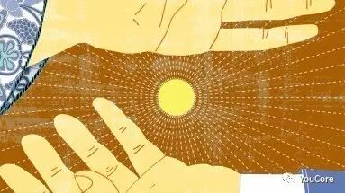
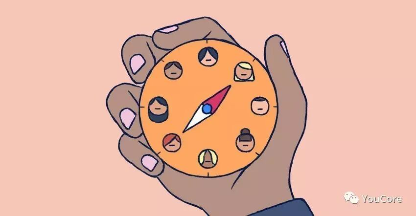
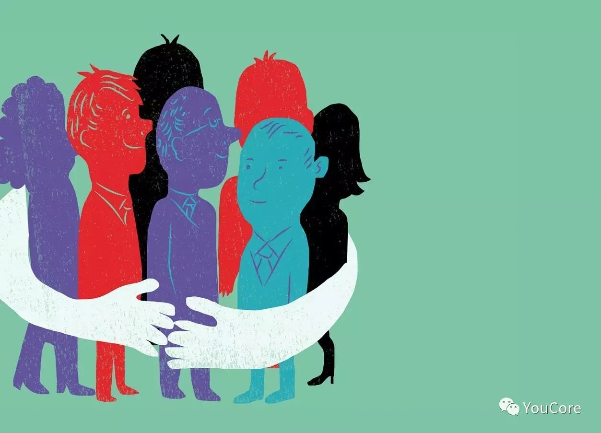
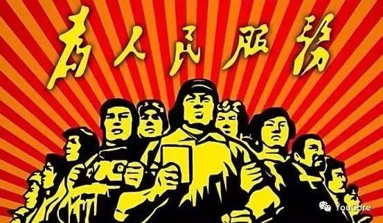

https://mp.weixin.qq.com/s/7TW2qEUsAUHJ4PHz0-e7Kg

# #不做老好人#三步打造有效人脉关系

文/晶美同学 

YouCore主策划 | 追求理性与感性平衡的女文青 | 知乎专栏《 框架的力量》入驻作者

交流微信：youcore_5

**1**********“好人”并没有好人脉********
** **

**自小我们被教育成一个“好人”，觉得“好人”就应当拥有好资源****。****直到大三实习时碰到的一件事，彻底改变了我对“好人”的看法。******

** ******

**我实习在一家颇具威名的行业协会，经常会组织行业内精英们聚在一起办个沙龙或者做个培训的工作坊等。Brenda所在的公司是这家行业协会的会员，她为人十分热心肠，当时已经做到了中层管理级别，但不管对上司还是下属永远都是热心相待，包括对我们这批算是打杂的实习生。而我们这帮小女生也常私下说以后一定要像Brenda一样，在职场上做到人人称赞才好。******

** ******

**这天又是培训工作坊。茶歇时，恰巧听到几个人聊起了Brenda。其中一个总监说，听说S公司的升职人员中没有Brenda。话音还未落，另外一位接着说，如果是我的话，可能也不会提（升）她。而周围的其他几位，则默默点头。******

** ******

**我震惊极了！虽然不太清楚他们具体的工作情况，但我可是亲眼见过这几位经常当面夸奖或者感谢Brenda的呀，而Brenda也总是忙前忙后，经常帮助她们。******

** ******

**这也是我第一次觉得：****或许，当个好人并没什么卵用。******

**
**

**后来自己进入职场，同样踩过很多坑**。**不想只被人贴着“好人”的标签，但是为了在职场上积攒好的人脉，却一直在做着老好人的事，让自己陷入了一个假的老好人的坑**。**慢慢摸索后，发现很多人对人缘、人脉的理解根本就错了！**

**
**

**善良本身并没有错的，但****有效的人脉关系是要看你能否将其转化成组织他人行动的能力。**

** **

**2**********如何将人脉转化成他人的行动？********

** ******

**既然有效人脉最终要转化成他人的行动，那我们今天讨论的主题就可以换成：****我们该如何通过关系构建，给别人一个行动起来帮助我们的理由。******

** ******

**那别人有什么理由来帮助我们呢？******

** ******

**一般来说，人与人之间的互助关系会经历三个阶段：****感性的单向冲动、理性的互惠关系和健康的价值流动。******

** ******

********第一阶段：感性的单向冲动************

** ******

**会有人平白无故地帮助人吗？当然有。而且****大多时候人脉建立的第一步就是感性的：对我没好处，我就是纯粹地想帮帮你！******

**
**

**这种情况经常发生在你有某个特性能够吸引到对方时，比如说你有能力。****很多大佬喜欢帮助年轻人，并不是因为他们指望从中得到什么实实在在的好处，而是****觉得你的能力，值得被帮助****；而很多更年轻的小辈也愿意为自己眼中的前辈尽些绵力，某个公众号的大V发条请求信息，可能马上一众粉丝马上蜂拥而上。******

** ******

**还比如说你有颜值。高颜值其实也是一个非常占有优势的特性，要不然读书的时候，为什么有校花在的宿舍，换宿舍时来帮忙的男同学总是特别多呢？**

** ******

********在这个阶段，该通过什么方法，促进他人行动？************

** ******

**1****）想办法提升个人能力，****通过合适的方式外显出来，让别人觉得你是一个值得帮的人。******

** ******

**2****）公开个人需求。****单向冲动阶段是由感性引发的，其关键在于有一方主动迈出第一步。如果你作为这段关系的请求方，首先应主动公开自己的需求，这样才会有人施以援手。******

** ******

**以上只是开了个头，都还只是非常浅度的关系，而且充满了不确定性。****如果没有进一步加深链接，对人脉关系搭建的帮助其实并不大。******

** ******

********第二阶段：理性的互惠关系************

** ******

**单向冲动后，如果另外一方也有所表示，接下来就极有可能进入到第二个阶段：****理性的互惠关系。**

**
**

****

**当然，还存在着另外一种可能：****其中一方本就冲着互惠关系才主动建立的联系****，也就是说这段人脉建立直接跨过了第一阶段的感性冲动期，这种情况常见于商业行为。而****我们日常生活中的关系构建，大多源于别人无利益相关的搭把手****（要相信，这个世界还是很美好滴）。******

**
**

**这个阶段的礼尚往来其实考虑的是投入产出比。****具体应用场景可能是，你之前帮过我，这次换我来帮你；还可能是，这次我帮你，寄望于下次你可以帮帮我。**

** ******

**********在这个阶段，该通过什么方法，促进他人行动？**************

** ******

**1****）作为主动帮助方，要在承受范围之内放低自己的回报预期****。在这一阶段，人人追求的都是低投入，高效产出。如果一味地斤斤计较，要求别人一定提供等值甚至更高质量的帮助，那么这段关系就很难有更深刻的发展。**

**
**

****值得一提的是，放低自己的预期并不是没有预期，**双方必须都有独立的掌控权，这样才能避免一方落入老好人的怪圈。**

**
**

****

**2）作为接收方，要避免一味地索取。****理性的互惠关系，需要的是近似值互换。在对方主动提出或者给予帮助时，如果不能及时地给予等值回应，要记得至少真诚地说声“谢谢”。**

********第三阶段：健康的价值流动************

** ******

**第二阶段中的互惠关系可以说是一次完整的博弈过程，****之所以说博弈，是因为主动付出后的回报概率往往是不可控的。******

** ******

**而如果在多次博弈后，双方已经有意无意地确认了对方的回报概率，找到了博弈的平衡点，并且能够坦然接受这种稳定的互惠关系，这也就是已经建立起了健康的价值流动。******

**就比如，我们和自己非常要好的朋友之间，你来我往时往往不需要任何思量，我们就会充分信任彼此，这是因为我们在试探性找朋友的交流期间，已经能够验证了对方的回报概率。******

** ******

**********在这个阶段，该通过什么方法，促进他人行动？**************

** ******

**1****）拥有更多的利益共同体 **** 好的人际关系得来不易，保证双方之间有更多的利益共同体才能长久维持这种优质的人脉关系。比如互联网时代一个很好的行动方式是，时不时地进行资源共享。**

**
**

**

**

** **

**3**********老好人错在哪儿了？********

** ******

**当我们回过头来看最开始的问题，我们发现很多时候****老好人的人脉关系只达到了最浅的第一步。******

** ******

**“对谁都好，什么事情都可以”，老好人的这种不选择性，很多时候让别人误以为他是，因为没有选择权，才一味给予的。****就比如我们身边最亲近的父母，他们好像没有任何理由对别人家的孩子好过我们，所以我们会习惯性地以为他们对我们的好是理所应当的。******

** ******

**而这种****最开始的不平等关系让老好人们失去了人脉关系进一步向前发展的机会****。甚至走不到“理性的互惠关系”这一步，****因为他们没有这场价值博弈的掌控权。******

** ******

**“好人”们有没有可能以一己之力建立起健康的价值流动呢？也有的，就是一方完全给予，丝毫不在意另外一方是否给予反馈。那这一类的人就不是为了构建人脉关系，而是存粹地服务他人。**

**
**

****

**可是我们都知道，****又有多少人是心甘情愿、没有缘由、持续地帮助任何人呢？******

** **

**4**总结

**“好人”都会有好人脉吗？并不是。******

** ******

**有效的人脉关系是要看你能否将其转化成组织他人行动的能力。******

** ******

**那么该如何建立有效的人脉关系，并且在建立步骤中积极促进这种关系建立呢？******

** ******

**首先，确认你们是在关系搭建的哪一个阶段，是还没迈开腿的感性冲动阶段，还是刚刚接触、相互试探的理性互惠阶段，或是交流成熟期的价值流动阶段。******

** ******

**然后根据所处的阶段，依次行动：******

** ******

**1、感性冲动阶段****：****想办法提升个人能力，通过合适的方式外显出来****，让别人觉得你是一个值得帮的人；****主动公开个人需求，积极寻求帮助。******

** ******

**2、理性互惠阶段****：在人人都追低投入高产出的这一时期，****吃点小亏反而是好事****，降低你的回报预期会更容易建立稳定的人脉关系；另一方面，也要常怀感恩之心，避免一味索取。****但请记得一定得建立自己的标准，不能一味地谦让别人。******

** ******

**3、价值流动阶段****：好的人际关系得来不易，保证双方之间有更多的利益共同体才能更稳定地交往。**

**
**

**● ● ● ● ●**** **

**
**

**更多延伸阅读****：**

- **如何最大化发挥一份工作的价值？**[戳这里](http://mp.weixin.qq.com/s?__biz=MzIxODU0NzA0MQ==&mid=2247483775&idx=1&sn=5a757a99a7ed341060bab13e76367f8e&chksm=97e99771a09e1e6760dee085b7705bbebd2db63c0cbad7bf50e05fcd04d28321d586872728aa&scene=21#wechat_redirect)
- 想构建你的**个人****能力树**？[戳这里](http://mp.weixin.qq.com/s?__biz=MzIxODU0NzA0MQ==&mid=2247483814&idx=1&sn=b2d8db745f7dc57274e2009ef1e11c36&chksm=97e997a8a09e1ebed930fc3905068fe7865f5e86e20790c7da10354bbb100845503fa4bef1fd&scene=21#wechat_redirect)
- **知识散乱**没体系？回复【1010】查看
- 学历、经验不如人，**如何逆袭**？[戳这里](http://mp.weixin.qq.com/s?__biz=MzIxODU0NzA0MQ==&mid=2247483856&idx=1&sn=1f75df33a9ce81e55e432a2de1025dea&chksm=97e997dea09e1ec8e2ad039fe8c05668f40f0594beeb3137ebf5a2b6188da1e1f6458f940f57&scene=21#wechat_redirect)
- **公司环境不太好，如何破****？**[戳这里](http://mp.weixin.qq.com/s?__biz=MzIxODU0NzA0MQ==&mid=2247483891&idx=1&sn=05dfa43bfe82721ef5c2e2800b970b98&chksm=97e997fda09e1eeb97977ddc6ab66331ecb0843e586e42447a6093426aedd360a8e362b7d9a4&scene=21#wechat_redirect)
- 你是如何**在职场上谋杀掉自己**的？[戳这里](http://mp.weixin.qq.com/s?__biz=MzIxODU0NzA0MQ==&mid=2247483969&idx=1&sn=4367e4314cc5de3e7690a1b82925e774&chksm=97e9944fa09e1d59aa7685d638de1a168263eec0563179c3d2634ad53474a443902134e6bb4a&scene=21#wechat_redirect)
- **工作又迷茫了**，怎么办？[戳这里](http://mp.weixin.qq.com/s?__biz=MzIxODU0NzA0MQ==&mid=2247484252&idx=1&sn=fe6da4bb99408f378202406bddcdb53f&chksm=97e99552a09e1c44a0afbb009e260996b8ccb60ff4e5eb3b97dd900eedd101caebfcf6cc4047&scene=21#wechat_redirect)
- 执迷不悔，**想去大公司**？[戳这里](http://mp.weixin.qq.com/s?__biz=MzIxODU0NzA0MQ==&mid=2247484223&idx=1&sn=493ce39718e84affad861ce49d3c1c48&chksm=97e99531a09e1c275259798ef4bc4d46cf29ef60229c6d47191825f513a32cad9625aaf5038f&scene=21#wechat_redirect)

---
*Source: [WeChat Article](https://mp.weixin.qq.com/s/7TW2qEUsAUHJ4PHz0-e7Kg)*