https://mp.weixin.qq.com/s/excBMwipnmuRe730a8qfDw

# 从0到1建设美团数据库容量评估系统

**总第632****篇 | ****2025年第029篇**美团数据库团队推出了数据库容量评估系统，旨在解决数据库容量评估与变更风险防控等领域难题。本文介绍了系统架构和主要功能：系统使用线上流量在沙盒环境回放验证变更安全，结合倍速回放技术探测集群性能瓶颈，构建容量运营体系实现集群容量观测与治理闭环。系统具备数据操作安全、结果真实可靠、灵活高效赋能等特点，有效提升数据库稳定性与资源利用率。

本文目录

- 01 项目背景
- 02 项目目标
- 03 能力全景
- 04 流量回放
- 05 容量上探
- 06 容量运营
- 07 未来规划

## 01 项目背景

数据库作为业务系统的核心基石，其重要性不言而喻。随着企业业务规模的持续扩张和社会影响力的不断提升，企业对数据库稳定性的要求也达到了前所未有的高度。在日常保障工作中，美团数据库团队也面临着诸多挑战，常见痛点如下：

**痛点一：活动期间数据库集群的读写容量上限难以准确评估，会出现容量不足导致生产事故。**

常见的容量评估方法包括指标计算和全链路压测：

- **指标计算**，通过比较负载指标与阈值的大小，判断节点是否健康，但流量与相关指标不是严格的线性关系，通过指标预测容量上限的准确性不高；
- **全链路压测**，通过录制上层业务流量并回放，能探测整条服务链路的瓶颈，但数据库流量会受压测场景复杂性、样本丰富度等多种因素影响，导致难以完全拟真，同时业务服务接入压测有一定的改造成本。

**痛点二：数据库变更是引起线上事故的主要原因之一，风险变更难以识别。**

常规的解决方法有固定规则拦截和线下测试：

- **固定规则拦截**，将拦截规则集成到变更平台中，通过固定规则判断变更风险，但诸如增加索引、修改字段类型等常规变更通常不会被拦截，这类变更可能导致 SQL 执行效率变差，进而引起数据库性能下降甚至系统崩溃；
- **线下测试**，通过线下环境测试识别风险，但可能因为线下与线上数据存在差异，以及测试不够充分，难以准确识别出所有潜在风险。

## 02 项目目标

建设数据库容量评估系统，通过使用线上真实流量回放方法，构建一套完整的容量评估体系，为数据库容量规划提供科学的数据支撑和决策依据。容量评估系统在建设时有以下基本要求：

**1. 数据操作安全**：数据库作为业务核心组件，回放和评估流程不能影响线上集群正常运行。**2. 评估结果真实**：需要使用完全拟真的流量和环境评估集群读写容量，并有可靠机制确保结果的有效性和准确性。**3. 系统灵活高效**：需要有高效的自动化能力支撑，同时需要具备高度灵活性，底层能力能够以插件化方式快速集成到各类系统中，完成回放验证功能的赋能。## 03 能力全景

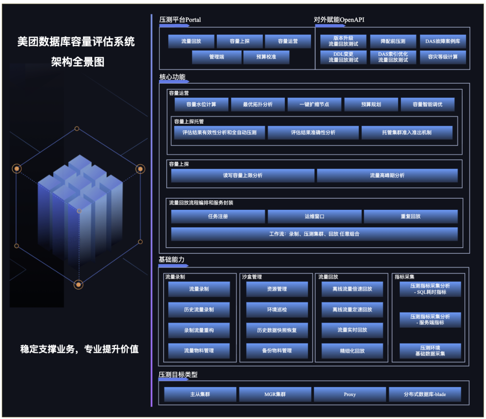

图 1 容量评估系统全景图- **压测平台**：用户与系统交互的门户，提供流量回放，容量上探，容量运营，预算校准等场景的操作页面。
- **对外赋能**：外部服务可通过调度系统提供的标准化接口（OpenAPI）应用回放能力，达成数据库流量回放能力赋能。
- **核心功能**：系统核心功能涵盖三个关键场景，即流量回放、容量上探与容量运营，共同构建了从测试到运营的全链路容量管理能力。
- **基础能力**：流量回放基础能力采用模块化架构设计，通过清晰的职责划分实现了功能解耦，大幅提升了流量回放的可操作性。
- **压测类型**：数据库流量回放能力在初期建设时并没有设限，只要是支持 SQL 协议的测试数据库目标或周边组件，均可以通过相应改造进而支持。

接下来我们将结合实际生产中常见的数据库应用场景，深入解析本系统**流量回放、容量上探、容量运营**三大核心功能及其对应的实现方案。

## 04 流量回放

评估的准确性是项目至关重要的考核指标之一，我们通过录制在线流量、构建沙盒环境并执行流量回放，以评估数据库集群性能。在数据库运维领域中，变更是高频高危操作，如参数调优、慢查询优化、版本升级等，那如何判断其变更后的效果和稳定性呢？下面将通过实际案例来介绍-流量回放。

### | 4.1 业务场景

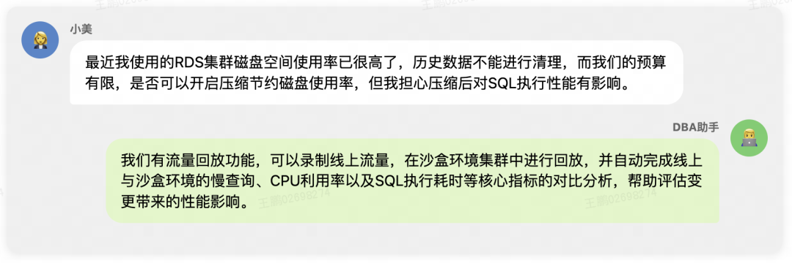

### | 4.2 架构设计

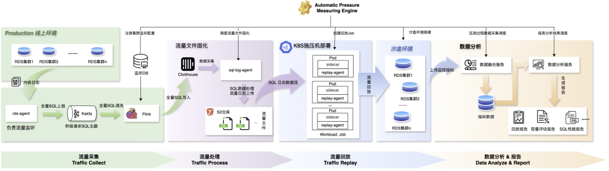

图 2 流量回放流程图我们通过录制线上数据库流量，并将其拟真回放到隔离的沙盒环境集群中，构建了一套完整的流量回放与分析能力。这一方案为运维变更提供了安全可靠的沙盒测试环境，能够在模拟真实流量的条件下验证变更方案，有效降低了生产环境风险。

完成整个流量回放测试需要以下四个核心流程：

**流量采集（Traffic Collect）**

该流程负责录制线上流量，为后续回放动作提供原始 SQL，此流程有三个重要模块。

**1. 数据采集**：公司自研的 MTSQL 内核采集了全量 SQL 的文本、事务 ID 和执行耗时等相关数据，并由数据采集器（rds-agent）传递到后端 Kafka。**2. 数据清洗**：通过 Flink 建立全量 SQL 清洗链路，消费全量 SQL Kafka 队列并过滤出回放注册集群的 SQL 信息。**3. 数据存储**：将原始 SQL 信息结构化写入至 ClickHouse 进行存储，支持高效处理大规模 SQL 数据，同时也为流量文件灵活编排提供拓展能力。**流量处理（Traffic Process）**

该流程负责对采集的 SQL 流量进行聚合、处理和固化处理。

1. 数据聚合： 流量文件处理器（sql-log agent）会从 ClickHouse 中按主、从角色扫描每个注册集群的全量 SQL 语句。2. 数据处理：流量文件处理器（sql-log agent）按照主库/从库角色分别完成回放 SQL 的结构化整理，主库采用事务维度聚合的方式处理 SQL，将同一事务内的多个 SQL 操作整合为一个执行单元，保证数据操作的一致性与执行效率；从库采用独立 SQL 维度处理，保证 SQL 独立执行更好模拟高并发读场景。3. 数据固化：经过处理的结构化数据会以流量文件形式持久化存储，并上传至 S3 供回放消费。**流量回放（Traffic Replay）**

该流程负责消费流量文件并在沙盒环境中实现流量回放，具体详细架构设计参考图 3。

1. replay-agent：作为回放动作执行主体，采用流式处理方式消费存储在 S3 中的流量文件，通过数据通信与控制算法，完成对 SQL 回放的节律控制，将流量拟真回放至沙盒隔离集群。2. 施压部署：将 replay-agent 封装部署在 Kubernetes 集群中，每个回放任务都会动态创建一个独立的回放 Job 资源，具备资源隔离、轻量化部署、弹性调度三大优势，可支持大规模压测场景。3. 沙盒环境： 通过数据备份构建流量录制时间起点时的全量数据快照，保证回放过程中增量数据的匹配。在回放前提供“运维变更窗口”，在此期间用户可根据需求完成变更模拟操作，如 MySQL 版本升级、参数修改、表结构变更等。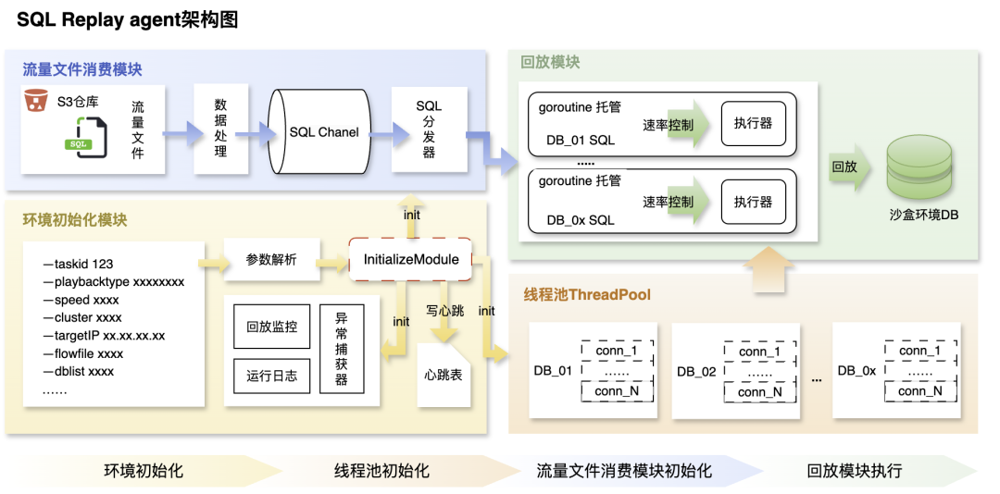

图 3 SQL Replay agent 架构图**数据分析&报告（Data Analyze & Report）**

该流程集成数据采集与分析能力，支持线上及沙盒环境的多维度数据采集，为用户提供全面、精准的可观测性支持，主要包括：

1. 运行负载指标，采集 CPU busy、系统负载（Load Average）、慢查询、主从延迟等指标。2. SQL 执行信息，采集每个 SQL 模板对应的执行耗时。3. 环境参数，采集 MySQL 核心参数配置、实例机型信息。### | 4.3 效果展示

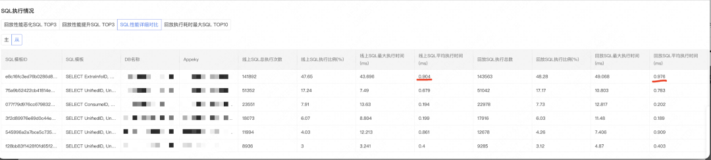

图 4 流量回放报告-SQL 执行情况对比流量回放分析报告会展示其恶化 SQL Top3、提升 SQL Top3 及 SQL 性能详细对比结果，从上述分析报告中可得出，开启表压缩后，执行最多的 SQL 耗时从 0.90ms 增加到 0.97ms，未出现明显下降，同时存储占用空间是原来的 40%，基于回放测试结论，小美的集群启用表压缩功能，执行表压缩变更后，系统稳定运行，磁盘空间不足问题得到缓解。

在美团，流量回放还在索引变更性能验证、数据库版本升级兼容性测试等场景中广泛运用。

## 05 容量上探

上述变更场景的流量是按在线一倍流量回放，而在实际业务诉求中，用户希望评估集群可承受的最大 QPS 是多少，能承受当前最大几倍的流量。下面将通过实际案例来介绍-容量上探。

### | 5.1 业务场景

### | 5.2 流程实现

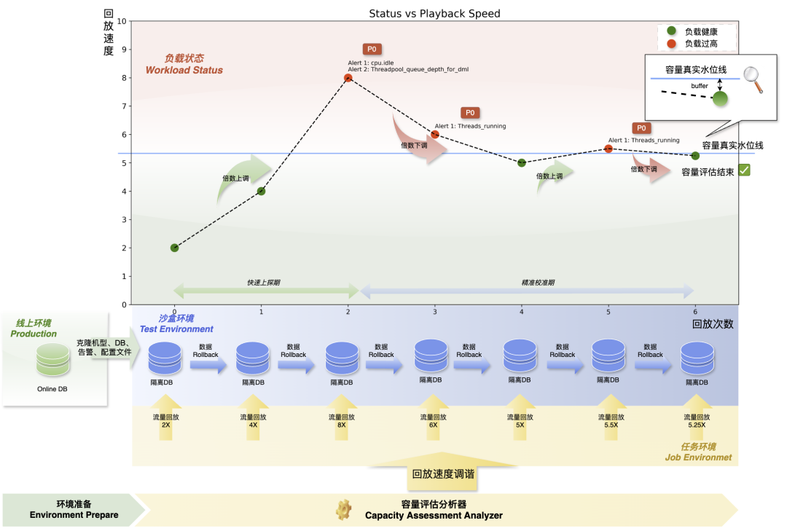

图 5 流量上探流程容量上探功能基于业务高峰期采集真实流量样本，在沙盒的测试环境中自动执行多轮加速回放测试。通过渐进式压力调节，逐步逼近数据库性能极限，最终探测到集群的最大承载读写 QPS。

**超载标准**

集群容量与告警紧密相关，用户根据业务场景为 RDS 集群设置相应的告警策略，集群出现告警表明集群超载。

**沙盒环境**

用户可根据实际需求灵活调整压测沙盒环境配置，如机型、MySQL 版本、核心参数等。在评估线上集群容量上限的应用场景中，为保证上探结果更真实准确，沙盒环境集群配置要求与线上集群保持一致。

**上探流程**

容量上探采用循环迭代的评估方式，每轮流量回放后，沙盒环境自动进行数据回滚，分析器会检索本轮告警，并对是否触达上限进行标记，同时计算下一轮回放速度。评估过程分为两个关键阶段：

1. 快速上探期：系统会持续提升流量回放倍速，通过指数加压的方式快速探测系统的告警触发边界，初步确定容量上限范围。2. 精确校准期：基于触发告警的最小回放速度和未触发告警的最大速度这两个边界值，分析器会进行二分计算确定下一次的回放速度。当达到预设精度要求时，评估循环自动终止，并输出最终的容量上探结果。### | 5.3 倍速回放

容量上探通过调整回放倍速模拟流量增长，倍速回放通过压缩 SQL 执行间隔，提升单位时间内的请求密度，从而增加数据库负载压力。

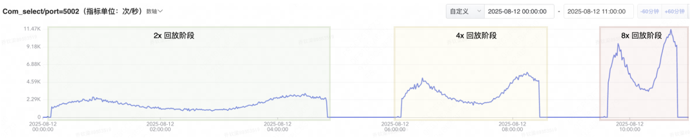

图 6 倍速回放 QPS 示意图在回放 agent 内，SQL 处理与回放处理的流程如下图所示：

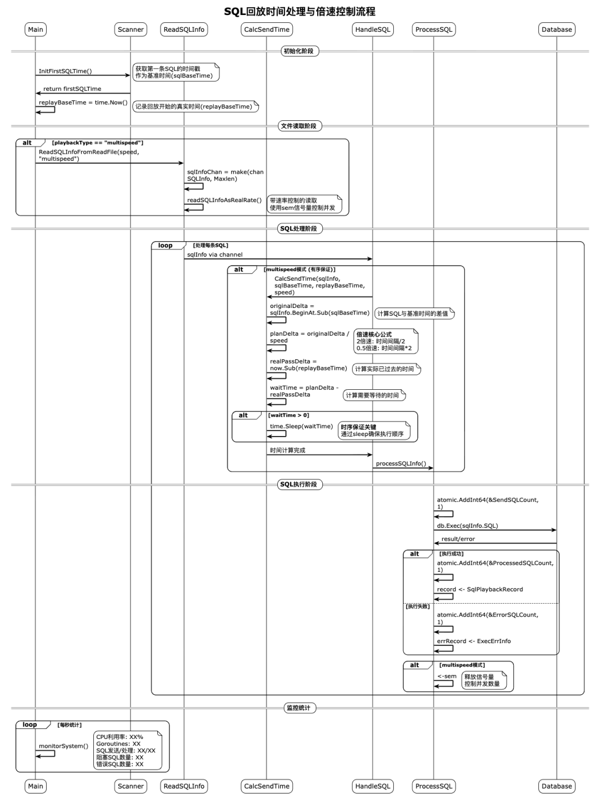

图 7 SQL 回放时间处理与倍速控制流程回放进程会为流量文件中的每一个待执行的 SQL 分配一个执行协程，在协程内部由 CalcSendTime 函数对 SQL 回放的时序进行精准控制，该机制具体实现如下：

1. 原始流量时间轴以 sqlBaseTime 为基准起点。通过计算 SQL 在线上环境的实际执行时间 sqlinfo.BeginAt 与 sqlBaseTime 的时间差，得到原始 SQL 执行的时间偏移量 originalDelta。2. 为实现倍速回放功能，系统会将原始 SQL 的时间偏移量 originalDelta 按回放速度进行缩放，得到调整后的回放计划时间偏移量 planDelta（计算公式：planDelta = originalDelta/回放速度）。3. 为了避免协程在 planDelta 时间点同步获取 SQL 并执行导致的流量失真，我们使用了 SQL 异步预获取逻辑，协程会预先分配要执行的 SQL，此时会记录当前系统时间 time.now，并计算此时距离回放开始的时间偏移量 realPassDelta。4. 系统通过比较 planDelta 与 realPassDelta 的大小关系来决定 SQL 执行时机：
这种时序控制机制确保了 SQL 回放过程能够准确匹配预设的回放速度，从而实现了可靠的倍速调节能力，SQL 倍速回放时序控制效果如下图所示：

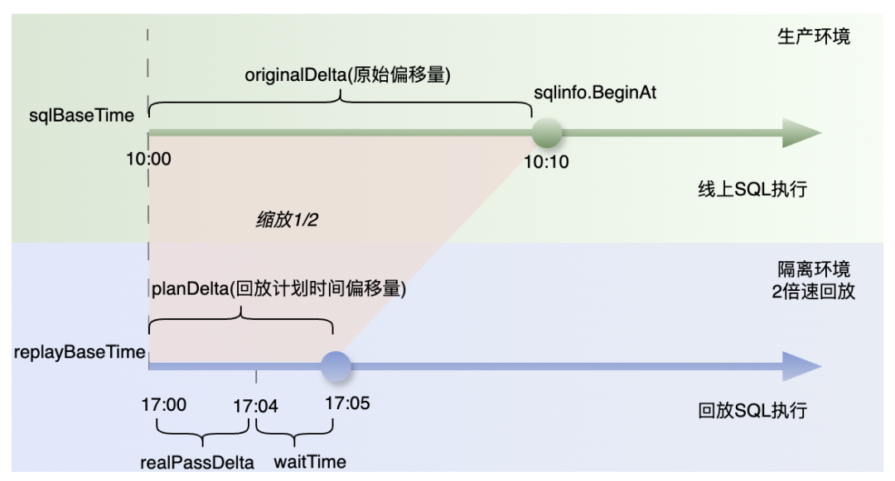

图 8 SQL 倍速回放时序控制示意图### | 5.4 效果展示

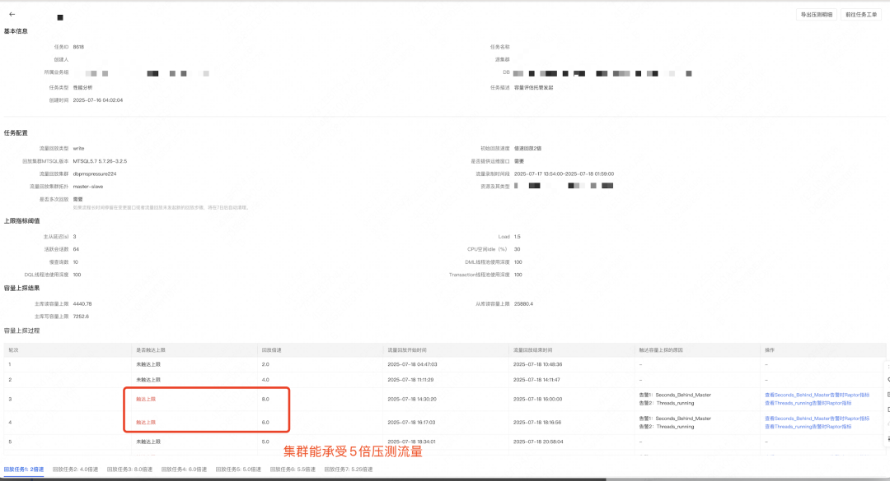

图 9 容量上探报告-上探过程展示容量上探报告会展示容量上探结果、不同倍数压测结果。从上述报告中可以看出，业务集群降低机器配置，流量到达 6 倍以上时才触发集群告警，完全满足业务 2 倍容量诉求，最终小美选择对该集群进行降配，降配后服务运行稳定。

在美团，容量上探还在服务器性能对比测试、数据库参数调优验证等场景中广泛运用。

## 06 容量运营

面对业务活动时，业务方希望 DBA 给予所有集群的容量状态的评估，当前所负责的集群处于什么水位线，是快到瓶颈、还是冗余很多？这里我们构建了容量运营服务，即时掌控集群容量状态。

### | 6.1 业务场景

### 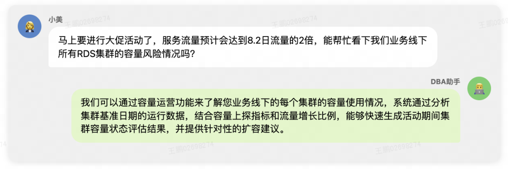

### | 6.2 运营设计

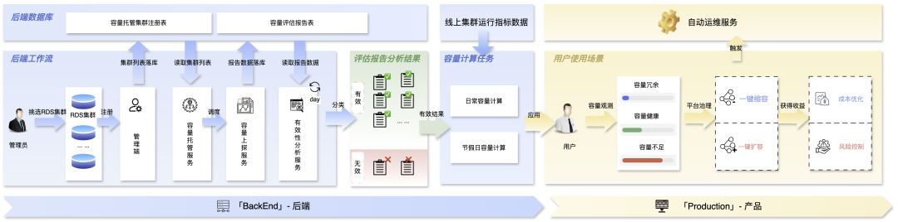

图 10 容量运营设计架构图容量运营是集成了三个核心功能模块：容量评估托管、容量计算和自动化运维，为大规模集群容量观测提供了便利入口，同时通过一站式运维管理，实现运营与治理闭环，显著提升运维效率。

**评估托管**

**1. 托管集群准入**：对具有稳定流量模型的核心集群进行托管准入注册，同时根据准入规则周期性调整托管列表，完成托管集群准入准出。**2. 自动托管执行**：所有注册托管的集群都将被自动纳入评估队列，由系统统一调度执行容量上探任务，每个集群最后都会获得一份容量上探报告以及读写 QPS 上限的评估结果，并设置有过期时间，逾期后进行自动重新评估。**3. 评估结果保鲜**：系统会定期检查每个托管集群的评估配置快照与线上集群当前配置的差异。若业务流量模型、硬件配置、版本与参数、告警阈值等配置发生变化，系统会将相关评估结果标记为失效状态并重新发起评估。**容量计算**

**1. 容量状态计算**：容量使用水位 = 线上集群 QPS/上探评估读写 QPS 上限，默认健康水位区间 [30%, 50%]，小于区间下限表示容量冗余，超过区间上限则容量不足（无法满足业务常态化 2 倍流量的承载需求)，水位线可按集群维度自行调整。**2. 容量建议计算**：生成运维优化方案。当检测到资源冗余时，系统会计算出满足容灾要求下的具体可缩容节点；当发现资源不足时，则会自动计算出需要扩容的节点数量，并给出最优的机房分布建议。**自动化运维**

**1. 建议采纳**：一键式交互逻辑，触发后台运维工作流，按容量建议自动完成运维动作。**2. 风险控制**：自动化运维链路具备可追溯、可观测、可回滚能力，确保变更稳定。### | 6.3 效果展示

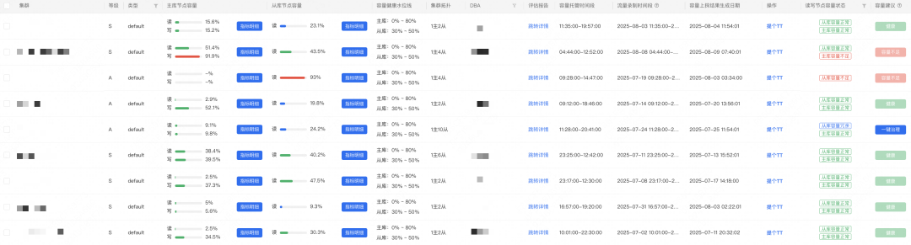

图 11 容量运营-集群容量使用水位明细容量运营报告展示集群主从、读写的容量使用水位以及容量建议，小美通过运营页面直观查看到所负责集群的容量状态，针对存在容量风险的集群，按照系统给出的容量建议完成了数据库扩容拆分工作，这一系列举措简化了以往复杂的评估流程，大幅提升了工作效率。

## 07 未来规划

**1. 支持更多数据库类型**：现支持 MySQL 主从，未来将支持 MGR、Proxy 及美团自研分布式数据库 Blade、Elasticsearch 等。**2. 辅助预算规划**：用户会根据当前资源使用和业务增长制定预算，但常忽略冗余资源。我们将与预算系统结合，帮用户直观了解当前冗余情况，减少预算填报。**3. 容量智能调优**：自动完成集群容量瓶颈分析与优化方案制定，并自动发起复测验证效果，进一步提升系统效率。**4. 案例库构建**：针对大促、事故等典型场景，能永久保留其案例库镜像，包括数据快照、SQL 流量以及集群配置信息，能为混沌工程以及 MySQL 的长稳体系，提供真实在线案例流量。
----------  END  ----------

 团队介绍 

美团数据库 DBA 团队，致力于为业务提供稳定、可靠、高效的在线关系型数据库服务，聚焦业务核心痛点，提供专业解决方案，支撑业务稳定快速发展。

 推荐阅读 

| [超大规模数据库集群保稳系列之一：高可用系统](https://mp.weixin.qq.com/s?__biz=MjM5NjQ5MTI5OA==&mid=2651773389&idx=1&sn=5005d023c42207a29e478c62e16804c5&scene=21#wechat_redirect)

| [美团MySQL数据库巡检系统的设计与应用](https://mp.weixin.qq.com/s?__biz=MjM5NjQ5MTI5OA==&mid=2651751923&idx=1&sn=3908b323818b299c13cb19da24d2eb91&scene=21#wechat_redirect)

| [基于代价的慢查询优化建议](https://mp.weixin.qq.com/s?__biz=MjM5NjQ5MTI5OA==&mid=2651767904&idx=1&sn=5cb1c15d7811c7e7225ac32b56026f99&scene=21#wechat_redirect)

---
*Source: [WeChat Article](https://mp.weixin.qq.com/s/excBMwipnmuRe730a8qfDw)*