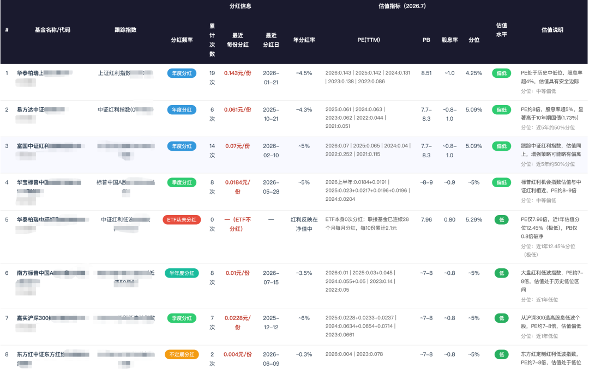
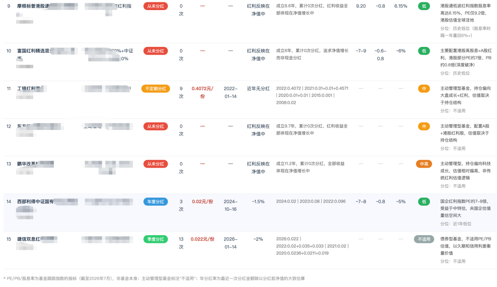
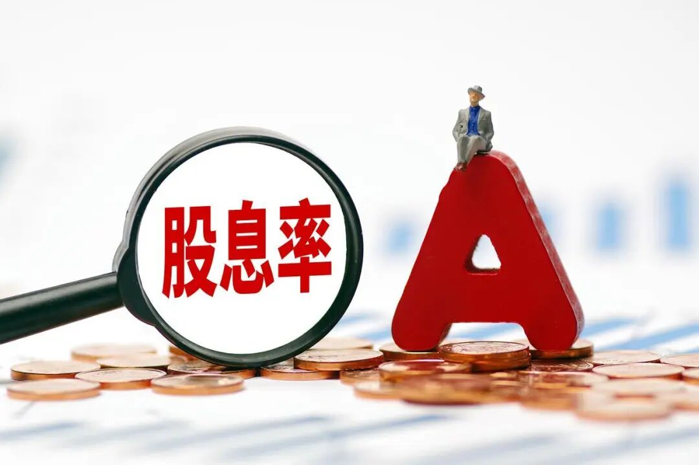
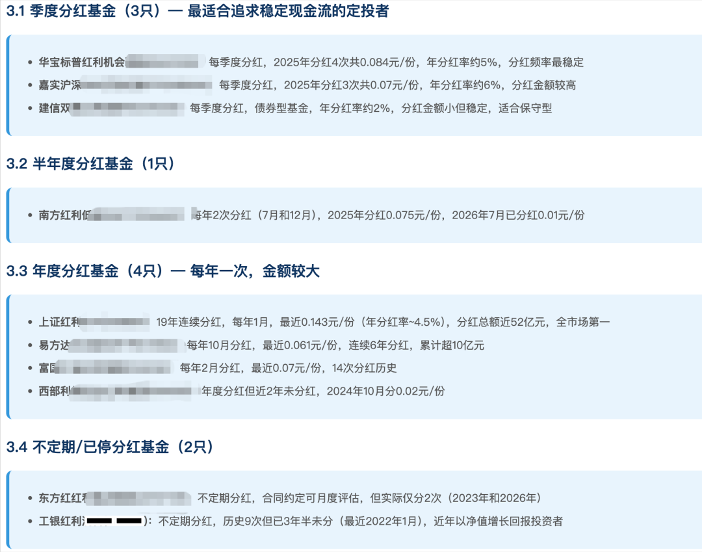
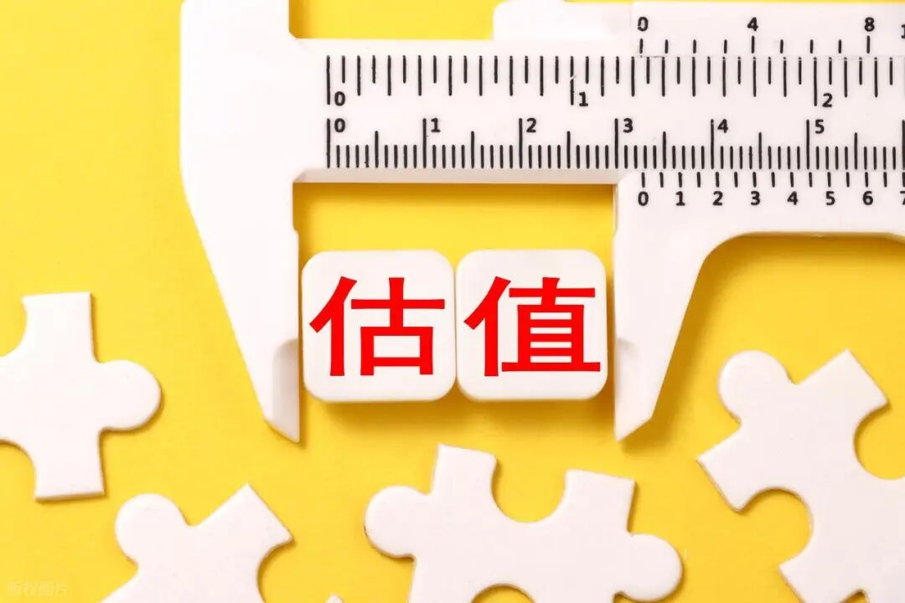
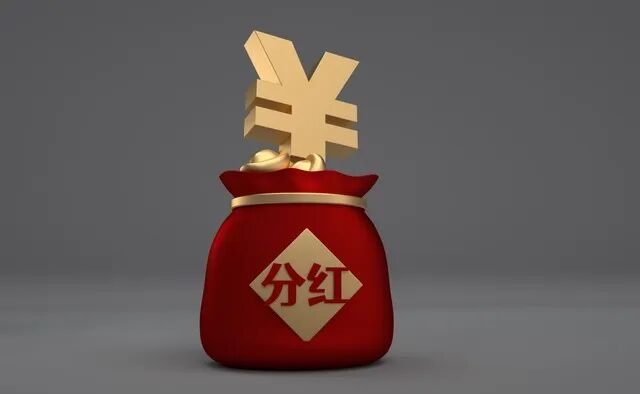

https://mp.weixin.qq.com/s/K5bzMI0hDLSKK_ASRJKV_g

# 从128只红利基金中精选15只，分红频率和估值水平一次看清

你有没有这样的经历——打开基金APP，搜"红利基金"，刷出来上百只，每只都说自己"高分红""稳收益"，看得眼花缭乱。最后随便挑了一只，持有一年才发现：有的基金年年分红，有的从来没分过红，有的越分越多，有的却越来越少。到底哪只才值得长期拿着养老？今天就从市场全部128只红利基金里，帮你筛出最值得定投的15只，把分红频率、分红金额、当前估值水平一次性讲透。

# 分红频率不等于分红能力

很多人以为，分红次数越多基金越好。这个直觉不能说全错，但漏掉了关键一环：分红只是把基金净值里的钱"取"出来给你，分不分、分多少，取决于基金公司的策略，不代表基金本身的赚钱能力。打个比方，两只母鸡都下蛋。一只每天把蛋摆在窝里让你拿走，另一只把蛋孵成小鸡让鸡群壮大。前者是你看得见的"现金分红"，后者是你看不见的"净值增长"。到最后算总账，后者可能比前者多赚好几倍。所以在选红利基金时，分红频率只是参考，真正要盯的是两个硬指标：一是底层资产分红能力强不强（看股息率），二是当前估值便不便宜（看PE和估值分位）。

# 15只基金分四类，对号入座

从128只红利基金中精选出的15只，按分红频率可以分为四类：第一类：季度分红型（4次/年）——适合想频繁拿现金的人。代表是华宝标普红利机会和嘉实沪深300红利低波动。华宝标普红利机会每个季度分红一次，最近一次每份分0.0184元，年分红率约5%。嘉实沪深300红利低波动年分红率更高，约6%。这类基金像"月薪制"，现金流稳定，适合用来补贴日常开支。第二类：年度分红型（1次/年）——分红频率低但胜在稳定。华泰柏瑞上证红利ETF是其中标杆，连续19年分红，从未间断。每年1月准时分红，最近一次每份0.143元，年分红率约4.5%。就像一只年年准时下蛋的老母鸡，虽然一年只下一次，但19年从没失约。易方达中证红利和富国中证红利指数增强也属于这一类，跟踪中证红利指数，股息率超过5%。

第三类：从不分红型——这一类最容易被误解。华泰柏瑞中证红利低波、摩根标普港股通低波红利、富国红利精选混合这三只，成立至今一次红都没分过。但别急着划走——它们不是不赚钱，而是把红利全部留在净值里继续滚雪球。以华泰柏瑞中证红利低波为例，虽然本身零分红，但它跟踪的指数股息率高达5.29%，这些钱全部体现在净值增长中。更关键的是，它当前PE仅7.96倍，近一年估值分位只有12.45%，处于极低位置。摩根标普港股通低波红利更极端，港股通低波红利指数股息率高达6.15%，PE仅9.2倍，港股可以说是全球估值洼地。第四类：债券红利型——建信双息红利债券季度分红13次，但本质是债券基金，分红来源是债券利息而非股票股息，适合追求极低波动的保守型投资者。

# 估值才是真正的安全垫

如果说分红频率是"面子"，那估值就是"里子"。15只基金里，当前估值处于低位的有多只：华泰柏瑞中证红利低波的PE 7.96倍、南方大盘红利低波50的PE约7-8倍、摩根标普港股通低波红利的PE 9.2倍、西部利得国企红利PE约7-8倍。这些基金不仅股息率在5%以上，而且估值处于历史低位区间，相当于"打折买高分红资产"。反过来，有些基金分红很积极，但估值已经不便宜。选基金不能光看分红金额大小，就像买房子不能只看租金高不高，还得看房价贵不贵。租金再高，买贵了也是亏。

# 普通人怎么选？

如果你追求稳定现金流，优先考虑华泰柏瑞上证红利（19年连续分红）搭配华宝标普红利机会（季度分红），一个保底一个加密。如果你更看重估值安全，华泰柏瑞中证红利低波动和摩根标普港股通低波红利当前处于估值极低位置，下行空间有限，适合慢慢定投攒份额。如果你想均衡配置，易方达中证红利和富国中证红利指数增强跟踪中证红利核心指数，PE约8倍、股息率超5%，进可攻退可守。记住一句话：分红是筛选好公司的尺子，但估值才是保护你本金的盾牌。两者结合，才是定投养老的正确姿势。

最后提醒各位老板：投资有风险，入市需谨慎。所有的理财工具都只是工具，怎么用、用多少，取决于你自己的风险承受能力和资金规划。但有一点可以肯定：知道有这么一个东西存在，本身就是一种理财能力的进步。最后也祝愿各位点赞转发的老板早日实现财务自由！咱们下期再见！文章编号：20260909热点文章推荐：[央行连买15个月黄金！手把手教你查“国家作业”抄投资答案](https://mp.weixin.qq.com/s?__biz=MzA3NTczODkyNA==&mid=2448503526&idx=1&sn=3c397c2f8694be624be4069d71c34671&scene=21#wechat_redirect)[千古经济奇书《盐铁论·本议》原文译文解读！富在术数，不在劳身！](https://mp.weixin.qq.com/s?__biz=MzA3NTczODkyNA==&mid=2448499566&idx=1&sn=02efde1c87a9f3a8dd7d09ee75f9fa59&scene=21#wechat_redirect)[一文读懂：中国银行业70年发展史上的程碑变化！](https://mp.weixin.qq.com/s?__biz=MzA3NTczODkyNA==&mid=2448499660&idx=1&sn=9dfceec6175e0986013bf287b2d2c09e&scene=21#wechat_redirect)[央行7000亿买断式逆回购是啥意思？对我们普通人有啥影响？](https://mp.weixin.qq.com/s?__biz=MzA3NTczODkyNA==&mid=2448503104&idx=1&sn=58a0f5d56c649c75eb7657b5b2e3debc&scene=21#wechat_redirect)[卡里余额时刻在变化，银行是怎么计算活期利息的？](https://mp.weixin.qq.com/s?__biz=MzA3NTczODkyNA==&mid=2448503035&idx=1&sn=d72887533608170c54de0828fec286d5&scene=21#wechat_redirect)[期货和期权，傻傻分不清？一文带你搞懂它们的区别！](https://mp.weixin.qq.com/s?__biz=MzA3NTczODkyNA==&mid=2448503016&idx=1&sn=292973d36a5543183d14d6135dcaae92&scene=21#wechat_redirect)[人民币的逆袭：为什么美国本次加息没能引爆其他国家经济？](https://mp.weixin.qq.com/s?__biz=MzA3NTczODkyNA==&mid=2448499677&idx=1&sn=b14161360a7b61d8301dc3a2d49df2d7&scene=21#wechat_redirect)[明显吃亏，为啥还这么多人选择？一文读懂等额本金VS等额本息！](https://mp.weixin.qq.com/s?__biz=MzA3NTczODkyNA==&mid=2448499596&idx=1&sn=de1e5463fdc9d4e0898aa526da64101c&scene=21#wechat_redirect)[一文读懂：什么是新质生产力？揭秘未来经济密码！](https://mp.weixin.qq.com/s?__biz=MzA3NTczODkyNA==&mid=2448499573&idx=1&sn=89b3d9f853e0aca1cc638d8cb6d1e629&scene=21#wechat_redirect)[财经小白必看！一文读懂蒙代尔不可能三角理论！](https://mp.weixin.qq.com/s?__biz=MzA3NTczODkyNA==&mid=2448499466&idx=1&sn=8ae00ec1855140579ba271f19e648744&scene=21#wechat_redirect)[央行常说的M0、M1、M2到底是啥？对我们生活又有啥影响？](https://mp.weixin.qq.com/s?__biz=MzA3NTczODkyNA==&mid=2448499405&idx=2&sn=ad94d952f9590060673caede35c654b9&scene=21#wechat_redirect)[通俗易懂：一文教你认清通货、通胀、通缩之间的区别！](https://mp.weixin.qq.com/s?__biz=MzA3NTczODkyNA==&mid=2448499371&idx=1&sn=8de0755807bcada1dbec143d034577f6&scene=21#wechat_redirect)[穿越历史长河：盘点美国9轮加息周期的利率变迁与全球经济格局演变](https://mp.weixin.qq.com/s?__biz=MzA3NTczODkyNA==&mid=2448499338&idx=2&sn=389896261d95bc53af0648e7c1849548&scene=21#wechat_redirect)[一文读懂：什么是国库支付？](https://mp.weixin.qq.com/s?__biz=MzA3NTczODkyNA==&mid=2448499290&idx=1&sn=5c2702a99b3fa76f721e5cf4366f7d8d&scene=21#wechat_redirect)[一文读懂：孳息与利息的区别！](https://mp.weixin.qq.com/s?__biz=MzA3NTczODkyNA==&mid=2448499060&idx=1&sn=6c6a17d91b9506d6e1f4cc3d477acb38&scene=21#wechat_redirect)[很多人炒股多年，却连“委托订单”是什么都没搞懂！](https://mp.weixin.qq.com/s?__biz=MzA3NTczODkyNA==&mid=2448503661&idx=1&sn=b46891d18564fa9738f6c7c646070cf1&scene=21#wechat_redirect)[很多人炒股多年，却连“股票除权”是什么都没搞懂！](https://mp.weixin.qq.com/s?__biz=MzA3NTczODkyNA==&mid=2448503687&idx=1&sn=07bb7e9094100064564fed714ed5c154&scene=21#wechat_redirect)[想靠股票实现财富自由？先搞懂“股息”和“分红”的区别！](https://mp.weixin.qq.com/s?__biz=MzA3NTczODkyNA==&mid=2448503722&idx=1&sn=4813996c952236262c829323324b6cd2&scene=21#wechat_redirect)[很多人不知道：除了股票，还有这种“躺着收钱”的股份](https://mp.weixin.qq.com/s?__biz=MzA3NTczODkyNA==&mid=2448503729&idx=1&sn=943f4c39805f43e8b4db047ca402b606&scene=21#wechat_redirect)

---
*Source: [WeChat Article](https://mp.weixin.qq.com/s/K5bzMI0hDLSKK_ASRJKV_g)*