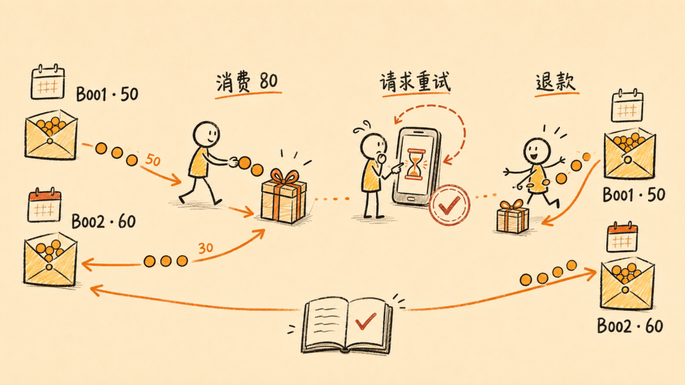
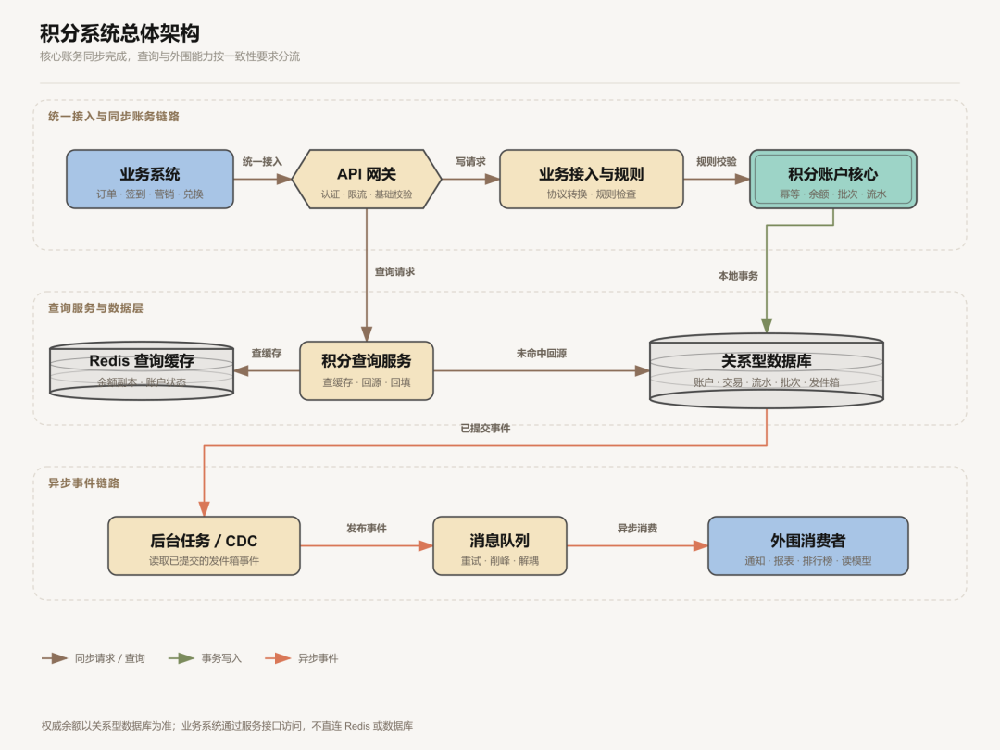
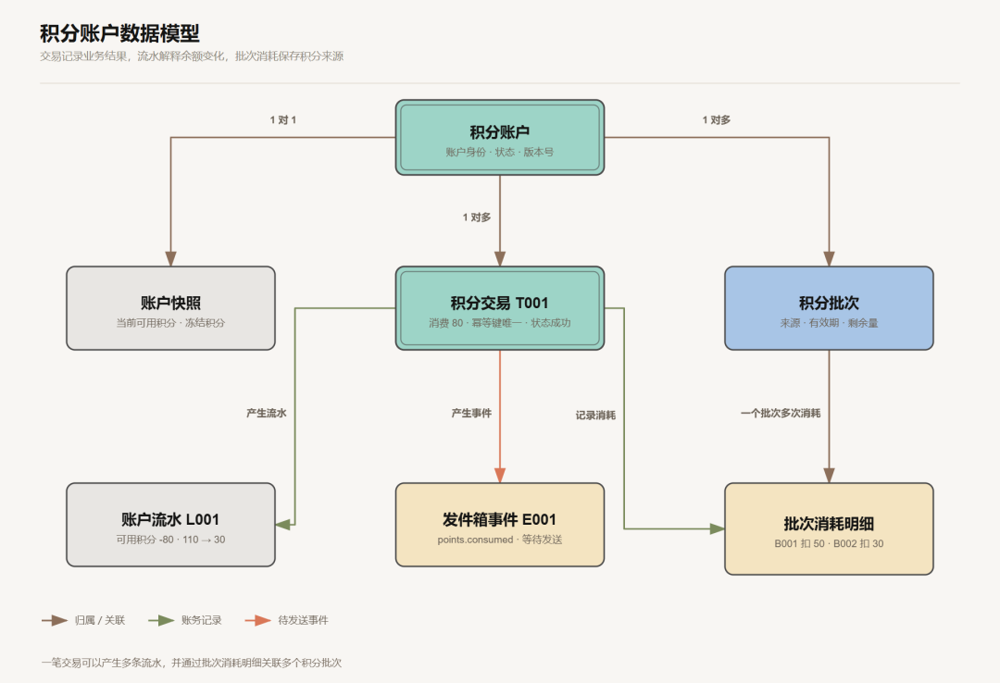
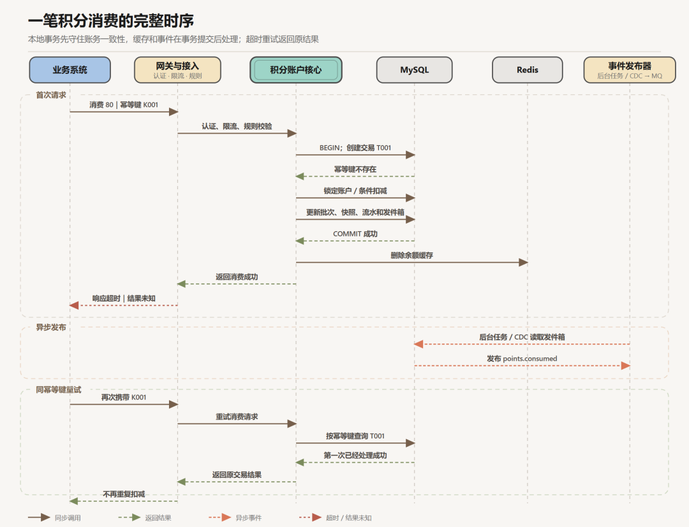

https://mp.weixin.qq.com/s/-o5i4O-fJItMXZO3vnv4AQ

# 架构设计 | 积分系统

> 积分系统表面上只是余额加减，真正落地时却要同时处理并发扣减、分批过期、请求重试、退款冲正和账务核对。本文从一笔积分消费出发，推演业务规则怎样一步步变成数据模型、一致性方案和系统架构。

把架构图画复杂并不难，难的是解释图上的每个组件为什么存在。

很多积分系统刚上线时，承担的事情并不复杂：用户下单或签到获得积分，再用积分兑换优惠券。业务量不大、规则也比较简单时，一张账户表加一个余额字段，可能就能支撑系统运行。

随着平台发展，订单、签到、营销活动、会员中心和商品兑换等业务陆续接入，积分也从某个模块的附属功能，变成多个业务共享的账户能力。同一笔积分开始有不同来源和有效期，活动期间还会出现集中发放、查询和兑换；一旦发生超时、退款或任务失败，系统既要保证结果正确，也要说清每一笔积分去了哪里。

为了把这些问题落到具体场景，本文假设平台已经有一千万注册用户。某个用户当前有 110 积分，分别来自两个批次：

●●●CODE

```
批次 B001：50 积分，9 月 30 日到期批次 B002：60 积分，12 月 31 日到期
```

现在用户兑换商品，需要消费 80 积分。请求发出后没有及时收到响应，于是客户端重试了一次；几天后订单又发生退款。

如果系统只有一张积分表和一个余额字段，加减 80 并不难。难的是回答后面这些问题：第一次请求到底成功没有？重试会不会再扣一次？80 积分来自哪些批次？退款时应该怎样退？缓存、消息或过期任务失败后，怎样证明最终余额仍然正确？

这才是积分系统真正的架构起点。



## 01先说清系统承诺，再讨论技术方案

“一千万注册用户”只是背景信息，不等于系统会同时承受一千万个请求。真正开始设计之前，还要确认三件事：系统要完成哪些业务动作，流量会以什么方式到来，以及哪些结果绝对不能错。

### 系统要完成哪些业务动作

积分的完整生命周期通常包括发放、消费、冻结与解冻、退款与冲正、过期、查询和对账。不同动作需要的数据并不相同：只考虑余额加减，后面遇到分批过期和退款时，数据模型很可能要推倒重来。

对外接口也要把语义说清楚。同一笔业务至少要带上业务方、业务单号和操作类型；返回“积分已经入账”还是“请求已经受理”，代表的是两种不同承诺，后面的同步链路和异常处理也会不同。

### “高并发”要变成可以验证的数字

为了便于推演，本文先做一组教学假设：系统有一千万注册用户，活动期间余额查询峰值为每秒 2 万次（2 万 QPS），积分变更峰值为每秒 3,000 笔（3,000 TPS），查询明显多于写入。这些数字只是设计输入，不是系统能力证明，真实项目还要用实际请求分布、数据规模和部署规格做压测。

除了总流量，还要看单账户最大并发写入。3,000 个请求均匀落在不同账户上，可以并行处理；100 个请求同时修改一个账户，却会集中竞争同一行数据。它直接影响我们选择行锁、乐观锁还是条件更新，也决定热点账户要不要单独限流。

### 哪些规则不能被破坏

系统经历重试、超时和局部故障后，至少要守住下面几条规则：

1. 同一业务操作只能生效一次；
2. 可用积分不能被扣成负数；
3. 每次余额变化都有不能随意覆盖的历史记录；
4. 退款和修正必须留下新记录，不能悄悄修改过去；
5. 账户余额最终能够由交易、流水和积分批次共同解释。

这些规则通常称为“不变量”。排行榜和运营报表可以晚几秒更新，但余额、幂等结果和账务历史不能用同样宽松的标准处理。

## 02先看完整架构：核心同步完成，外围异步收敛

需求边界清楚以后，可以先画一张简单的总体图，而不是立刻讨论 Redis 集群或分库分表。



普通余额查询先经过 API 网关进入积分查询服务，再由查询服务优先访问 Redis；缓存未命中时，由查询服务回源权威数据库并重建缓存。明细和报表可以访问只读副本或专门的读模型；扣减、冻结等核心判断，始终回到账户核心和权威数据库。

读这张图时，先看同步和异步边界，不必急着数里面用了多少种产品。在本文的设计里，一次账户变更涉及的账户快照、交易、流水和批次由同一个本地事务提交；通知、报表、排行榜等外围工作再通过事件异步更新。

图中的接入、规则、账户、过期、对账和查询表示业务边界，不要求第一天就部署成六个微服务。项目早期可以采用模块化单体，先把数据所有权和依赖方向理顺。即使以后拆服务，负责账务原子更新的账户核心也不宜切得太碎，更不能让其他服务绕过接口直接改账户数据库。

## 03余额之外，还要保存哪些数据

如果积分表只有 ```
user_id
```

 和 ```
balance
```

，系统只能回答“现在有多少”，却解释不了积分从哪里来、为什么减少、什么时候过期。要支撑完整生命周期，通常需要下面几类数据：

数据解决什么问题关键要求账户快照当前有多少可用、冻结积分用于快速查询，与账务变更同事务更新积分交易发生了哪次业务操作、处理到什么状态幂等键唯一，状态可追踪账户流水余额为什么变化、变化前后是多少只追加，不覆盖历史积分批次积分来自哪里、何时到期、还剩多少支撑过期规则和消费顺序批次消耗明细一次消费具体用了哪些批次能关联消费交易与原始批次发件箱事件哪些变更还需要通知其他系统与核心变更同事务提交这几类数据不是一一对应的。一笔积分交易可能产生多条流水，也可能消耗多个批次；发件箱事件则不负责记账，只记录尚待处理或发送的通知。

回到开头的例子，消费 80 积分后可以得到：

●●●CODE

```
积分交易 T001：消费 80，处理成功账户流水 L001：可用积分 -80，余额从 110 变为 30批次消耗 A001：从 B001 消耗 50批次消耗 A002：从 B002 消耗 30账户快照：可用积分 30发件箱事件 E001：points.consumed，等待通知下游
```

积分交易记录这次业务操作的整体结果，账户流水解释总余额怎样变化，批次消耗明细则说明这 80 积分具体来自哪里。有了这层对应关系，系统才能在退款时找回原来的批次和有效期。

账户快照让查询更快，流水负责解释结果，交易保存处理状态，批次管理来源和有效期。它们应在同一本地事务中更新，避免余额已经减少，流水或批次却没有跟上。

如果积分涉及多个发行方、商户结算或账户之间的价值转移，可以进一步采用复式记账，用相互对应的分录追踪来源和去向。不过，积分子账不等于企业财务总账。对于单一平台、规则简单的积分系统，“账户快照 + 不可变流水 + 积分批次”通常已经够用。选哪种模型，最终要看余额能否被历史记录完整解释。



## 04一笔积分消费，怎样从开始到结束安全完成

数据模型确定以后，再沿着一次消费请求走完整条写入链路。

### 第一步先用幂等键确认这笔操作是否处理过

客户端超时，不代表服务端一定失败。积分核心不能收到一次请求就扣一次，而要用稳定的业务身份识别同一操作：

●●●CODE

```
幂等键 = 业务方 + 业务单号 + 操作类型
```

“消费”“冻结”“确认扣减”和“取消冻结”是不同操作，不能共用一个含义模糊的键。网关可以拦截明显重复流量，但最终幂等结果必须由积分核心持久化，并通过数据库唯一约束守住。

### 第二步在一个本地事务里完成记账

以立即消费 80 积分为例，一次事务可以概括为：

●●●CODE

```
1. 按幂等键创建积分交易，已存在则返回原结果2. 锁定账户，或使用版本号控制并发3. 原子扣减可用余额，保证余额不小于 04. 按“较早到期优先”消耗 B001 的 50 和 B002 的 305. 写入两条批次消耗明细，并追加账户流水6. 更新账户快照，写入待处理的发件箱事件7. 提交事务并返回结果
```

行锁、乐观锁和条件更新没有固定答案，要看单账户冲突概率和压测结果。无论选择哪种方式，都不能先读出余额、在应用里判断后再无条件覆盖；最终扣减必须由数据库的并发控制保证不会超扣。

一次调用就能完成的兑换可以直接扣减。只有订单之后还可能确认或取消时，才需要“冻结 → 确认扣减／取消解冻”的状态机。冻结不是所有消费场景的固定步骤。

### 第三步提交数据库后，再处理缓存

余额缓存采用旁路缓存（Cache-Aside）时，通常先提交数据库事务，再删除缓存。下一次查询发现缓存不存在，才从数据库读取新值并重建。

数据库提交和 Redis 删除不是同一个事务，删除可能失败。可以在账务事务里同时写入缓存失效事件，由后台任务直接重试删除；如果同一事件还要通知多个系统，或者需要削峰和独立扩容，再由后台发布器把事件送入消息队列（MQ）。MQ 不是事务发件箱的必选项，发件箱表本身也可以在一定规模内承担可靠任务队列的职责。

缓存还要设置合理的过期时间和版本号。热点缓存失效时，可以通过请求合并或短期租约只允许一个线程回源；回填前再次校验版本或租约，避免一个读到旧值的慢请求在缓存删除之后又把旧数据写回来。即便如此，积分扣减仍应以数据库为准，不能根据 Redis 余额直接记账。

### 第四步跨系统通过事件收敛

订单完成后发积分，会跨越订单系统和积分系统。常见做法是订单系统在同一个本地事务中保存订单状态和发件箱事件，后台任务或变更数据捕获（Change Data Capture，CDC）再把已提交事件发送出去；积分系统收到事件后，以业务单号和操作类型幂等入账。

事务发件箱解决的是“业务已经提交，事件却没保存下来”的缺口，但不会让消息天然只处理一次。发送任务可能重复投递，消息也可能延迟或乱序，消费者仍要幂等，并处理重试、死信、顺序和对账。



## 05请求失败、积分退款或到期后，怎样把账找回来

账务系统还要面对超时、退款、任务重跑和数据差异。异常发生后能否解释结果、恢复状态，往往比正常流程更考验设计。

### 请求超时：重试只能得到原来的结果

开头的消费请求虽然超时，但只要客户端带回同一个幂等键，积分核心就应该查到交易 T001，并返回第一次的处理状态，而不是重新扣减。如果第一次仍在处理中，可以明确返回处理中，或者等待有限时间后让调用方查询结果。

### 订单退款：新增冲正，不修改原交易

退款时应创建一笔能够关联 T001 的新交易和反向流水，而不是把原流水删除。系统根据 A001、A002 找到当时消耗的两个批次，再按业务规则恢复积分。

如果退款发生时原批次已经到期，究竟立即失效、沿用原有效期，还是获得新的有效期，属于必须提前约定的产品规则。技术系统要做的是保存原始分配关系，并把最后采用的规则和结果完整记录下来。

### 积分过期：按批次处理，并保证任务幂等

过期任务不能只改总余额。它要找到已到期且仍有剩余量的批次，生成稳定的过期任务标识，在同一事务中减少批次剩余量、更新账户快照并追加过期流水。

数据量大时，可以按到期日期和账户范围拆分任务，由多个节点执行。调度租约负责分工和故障接管，稳定的任务标识则防止节点切换或任务重跑造成重复清零。

### 对账：发现问题以后，还要受控修复

周期性对账至少检查三类关系：

- 账户可用、冻结余额是否与流水和批次汇总一致；
- 业务系统与积分系统能否在总量和逐笔状态上对应；
- 发件箱、消息消费和下游读模型是否存在长期未完成记录。

系统可以根据差异生成差错记录和处理工单，附上业务单号、账户、积分数和差异类型。自动发现问题不等于自动改账：先定位原因，再走受控的补录或冲正流程。直接把余额改成一个“正确数字”，审计链断了，真正的故障也可能还在继续。

## 06流量和数据增长以后，系统怎样扩展

系统扩展应从已经出现、或者能够量化的瓶颈出发。下面分别看查询、核心数据和热点账户。

### 查询多了：使用缓存和读模型

Redis 可以保存余额副本、账户状态和热点汇总。历史明细、排行榜和运营报表可以异步构建读模型，也就是按查询需要重新组织、合并或汇总的一份数据。读模型不是账务事实，也不能用于决定能否扣分。

热点缓存失效时，要避免大量请求同时回源；一批缓存键的过期时间可以加入少量随机值，避免集中失效。无效参数和越权请求应在入口拦截；对于格式合法但确实不存在的账户，可以短期缓存空结果，避免请求反复打到数据库。

### 核心数据多了：先归档，再决定是否分片

账户、交易、流水、批次、幂等记录和发件箱适合保存在支持事务与唯一约束的关系型数据库中。普通明细和报表可以走只读副本或异步读模型，但扣减判断和权威余额仍以主库事务为准。

历史流水可以分区或转入低成本归档存储，前提是完整性、查询和恢复流程仍能验证。很多系统做完冷热分层和索引优化后，并不需要立即分库分表。

单库容量或写入真正达到上限时，可以按账户标识稳定路由，让一次单账户变更涉及的数据落在同一分片，继续使用本地事务。流水量很大时，可以在账户分片内部按时间分区或滚动表，不要只按时间把同一账户的数据打散到不同路由。

幂等键如果不包含账户等路由信息，分片后就难以依靠单库唯一约束完成全局去重。如果使用跨账户复式分录，还要让对应分录处于同一事务边界，或者承担独立账本与跨分片协调的成本。

### 热点账户：总容量够，不代表单点没有瓶颈

普通用户账户的并发通常不高，但商户公共账户、活动账户或平台发行账户可能成为热点。增加应用实例并不能让同一个账户行无限并发写入。常见处理包括限制单账户并发、按账户顺序执行、缩短事务时间，以及在业务允许时把公共账户拆成多个子账户后再汇总。

## 07系统怎样上线，又怎样逐步演进

积分系统上线前，还要把稳定性、安全、可观测性和成本放进同一张设计图里。

入口应按业务方、接口和账户限流；远程调用设置超时，只对可重试且幂等的操作做有限重试。连接池、消费线程和批任务并发要从下游吞吐反推，不能为了追赶消息积压把账户数据库冲垮。备份和故障转移还要通过恢复演练验证，并根据业务损失明确恢复点目标（RPO）和恢复时间目标（RTO）。

如果这些模块以后拆成独立部署的服务，还要处理注册发现、负载均衡、配置管理和灰度发布。指标、日志和链路追踪最好使用统一的请求号、业务单号或交易号串联。除了吞吐量、延迟和错误率，还要关注幂等冲突、账户锁冲突、发件箱积压、消息重试、过期任务进度和对账差异，并为异常增长设置告警。

业务接入需要认证、授权和防重放；跨网络或跨组织调用时，再根据风险选择签名校验。高价值兑换可以增加风险校验。人工调账要有专门权限、审批和不可随意修改的审计记录。缓存和读模型用于分担主库压力，但也有资源成本；可靠性资源应优先留给核心账务库，历史数据再分层归档。

系统可以按真实问题逐步演进：

1. **先把账记对**：模块化单体加关系型数据库，用本地事务完成账户、交易、流水和批次闭环；
2. **再移开非核心工作**：查询成为主要流量后引入缓存，通知和报表拖慢主链路后再异步处理；
3. **按瓶颈扩展**：数据库容量达到上限后再分片，业务线和团队增多后再拆服务，历史数据影响在线性能后再归档；
4. **提高恢复等级**：积分开始抵扣高价值权益或跨主体结算后，再加强冻结确认、清算、对账、容灾和审计。

架构往往就是这样长出来的。每增加一层东西，都应该能说清它解决了什么已经出现、或者至少能够量化的问题。

## 08结语

回头再看开头那笔 80 积分的消费，真正需要设计的从来不只是一次减法。业务规则决定积分怎样消费和退回，数据模型负责保存可以追溯的事实，本地事务守住账户内部的一致性，幂等、事件、冲正和对账则让系统在超时与故障后重新收敛。

逐步推演时，不需要先把所有可能用到的组件塞进一张架构图。先画清业务边界、核心流程和数据关系，再给出当前真正要落地的架构；可能出现的下一步，另用演进图说明，并写清触发条件。幂等、事务边界和数据模型这些后期难改的部分要提前想清楚，缓存、消息队列、分片和微服务则根据真实瓶颈逐步引入。思考尽量完整，落地保持克制，演进路线提前留好。

 AI 探索不迷路，关注我不走弯路


---
*Source: [WeChat Article](https://mp.weixin.qq.com/s/-o5i4O-fJItMXZO3vnv4AQ)*