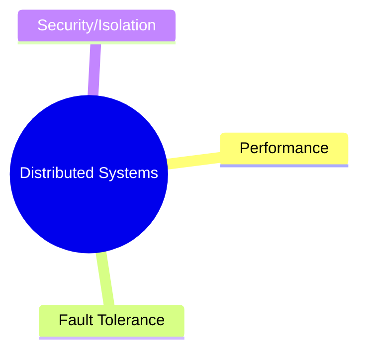
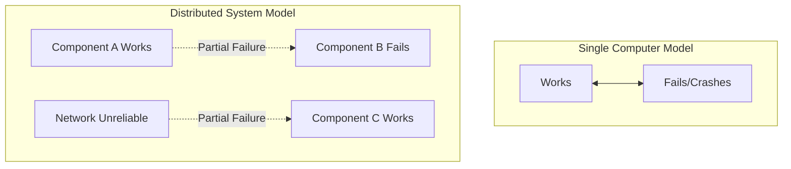

### Distributed System Concepts

- **Security through Isolation**
    - Security can be achieved by splitting tasks across multiple computers
    - This allows for isolation between processes
    - Components communicate via narrowly defined network protocols
- **Course Focus**
    - The primary focus of the course is on performance and fault tolerance
    - Security and isolation are secondary factors that influence the construction of these systems

### Challenges in Distributed Systems

- **Complexity from Concurrency**
    - Distributed systems consist of many parts that execute concurrently across multiple computers
    - This concurrency leads to several inherent difficulties:
        - Problems associated with concurrent programming
        - Complex interactions between different components
        - Weird, timing-dependent behaviors (race conditions/non-determinism)

### Unexpected Failure Patterns

- Distributed systems face more complex failure modes than single computers
    - **Single Computer Failures**: Usually binary (the computer either works or it crashes/suffers a power failure)
    - **Distributed System Failures**: Characterized by partial failures
        - Some pieces of the system stop working while others continue to function
        - The network itself may become broken or unreliable even if individual computers are working

### Motivations for Distributed Systems

- **Primary Drivers**
    - Distributed systems are often constructed to achieve specific goals that single-computer systems cannot easily meet (to be discussed).

### Performance Scaling Challenges

- **The Goal of Performance**
    - Distributed systems are often built to leverage massive resources
    - Examples include gaining the combined power of a thousand computers or a thousand disk arms
- **The Difficulty of Scaling**
    - Achieving a "thousand X speedup" with a thousand computers is extremely tricky
    - It is not a guaranteed outcome of simply adding more hardware
    - **[Why it's hard]** There are many roadblocks that prevent linear performance gains, requiring careful system design to actually realize the intended performance benefits

### Course Objectives and Context

- **Addressing Core Challenges**
    - The course focuses on solving the inherent issues identified:
        - Concurrency
        - Partial failure
        - Performance
- **Technical Interest**
    - The problems and their solutions are often technically challenging and interesting
    - **[The Reality of Solutions]** Some problems have well-established solutions, while others remain difficult with no perfect known answers
- **Real-World Application**
    - Distributed systems are not just theoretical; they are used by a vast number of real-world systems

### The Evolution of Distributed Systems

- **Shift in Importance**
    - Once viewed primarily as an academic curiosity used only at a small scale
    - Now a critical technology driven by the rise of giant websites
- **Drivers of Modern Adoption**
    - The need to manage vast amounts of data
    - The requirement to coordinate massive numbers of computers (entire warehouses full of computers)

### The Growing Importance of Distributed Systems

- **Infrastructure Status**
    - Over the last 20 years, distributed systems have become a seriously important part of computing infrastructure
    - This shift has led to a massive amount of attention being paid to the field
- **Research Opportunities**
    - **[Current State]** While many problems have been solved, there are still quite a few unsolved problems
    - For graduate students or those interested in research, the field offers many open problems to investigate

### Course Practical Experience

- **Lab Sequence**
    - Designed for students who enjoy building systems
    - Involves constructing fairly realistic distributed systems
    - **[Core Focus]** The labs specifically target two key areas:
        - Performance
        - Fault tolerance

### Course Logistics and Staff

- **Course Resources**
    - **Course Website**: Accessible via Google; contains lab assignments and the course schedule
    - **Piazza**: A dedicated page for posting questions and receiving answers
- **Course Staff**
    - **Instructor**: Robert Morris
    - **Teaching Assistants (TAs)**: Four TAs who are experts in the subject matter

### Course Components and Support

- **Support from TAs**
    - TAs are experts specifically in solving the labs
    - **[Getting Help]** Students can ask questions via Piazza or by attending TA office hours
- **Course Components**
    - **Lectures**: Almost every lecture is accompanied by a research paper
    - **Exams**: There are two exams in the course