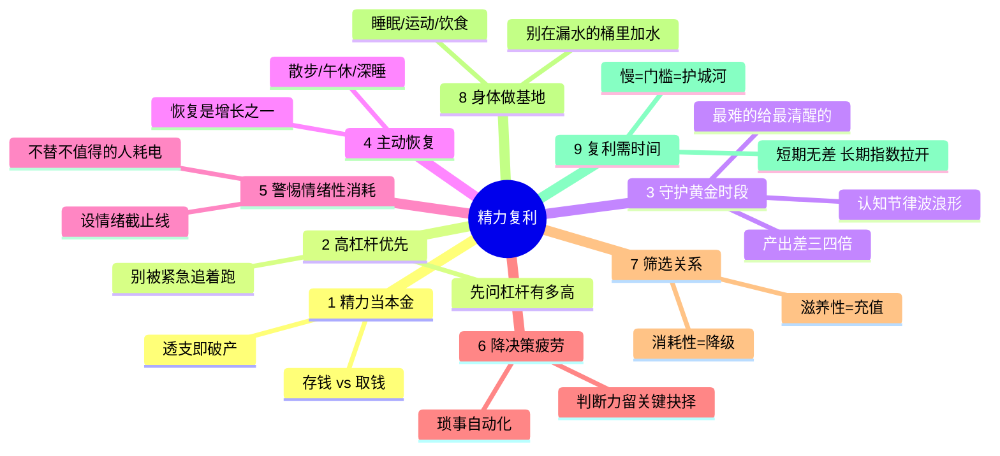

# 精力复利

> **文本说明**：来源文件疑为语音转写稿，标点/断句异常。按规约原始资料不可修改，以下据原文内容整理。

## 一句话主旨

决定一个人长期高度的不是投入了多少时间，而是有没有守住并**复利式增长自己的精力**——精力像本金一样可以被投资、被增值，也可以被日复一日透支亏空直到破产；聪明人经营的从来不是时间，而是精力的复利。

## 关键论点

文章以一项"跨越十余年的哈佛追踪研究"为引子，将精力管理拆解为 9 个维度（各维度的研究均归因于哈佛/斯坦福等机构的团队，**全文未点名具体学者或论文**）：

1. **把精力当本金，不当消耗品**。普通人是"用完就没"的消耗思维；长期表现优异者把精力当作可投资、可增值的本金，本能分辨当下这件事是在"存钱"（精力再生产）还是"取钱"（纯粹失血）。核心自问：今天做的到底是存钱还是取钱？→ 概念：[[精力账户]]、[[精力复利]]

2. **优先处理高杠杆的事，而非紧急的事**。一天七八成精力被"看似紧急但影响很小"的事吃掉；动手前先问"这件事的杠杆有多高"，把琐事排在真正有杠杆的事之后，不让"紧急"的假象抢走最重要的精力。→ 概念：[[高杠杆任务]]

3. **最佳时段永远留给最重要的事**。[[认知节律]]研究发现专注力呈波浪形起伏，多数人的认知峰值在上午；把需要深度思考的核心工作放到精力峰值而非谷底，同样投入 8 小时，产出可能差三四倍——差的不是能力，是对时段的敬畏。

4. **主动设计恢复，而不是被动等崩溃**。恢复不是软弱，而是精力再生产的必要环节；像安排工作一样认真安排恢复（不被打扰的散步、放下手机的午休、高质量睡眠），恢复本身就是增长的一部分。→ 概念：[[主动恢复]]

5. **对情绪性消耗格外警惕**。最隐蔽的精力漏洞往往不是体力疲惫，而是情绪上的反复拉扯（生闷气、焦虑、反复咀嚼他人评价）——不出汗、无血、却把人彻底榨干；要给情绪设一条截止线，允许难受但只给有限时间，然后拉回能创造价值的事。→ 概念：[[情绪性消耗]]

6. **减少决策疲劳，把判断力留给关键时刻**。人每天能做出高质量判断的次数有限，每次决策（穿什么、吃什么、回哪条消息）都悄悄扣减额度；顶尖的人把生活琐事决策自动化，把有限的判断力省下来留给真正需要深思熟虑的抉择。→ 概念：[[决策疲劳]]

7. **对人际关系做精力筛选**。长期消耗性的关系持续从精力账户扣款，滋养性的关系则充值；诚实地审视身边关系，对消耗者降低投入优先级，对滋养者多花时间和用心——把精力给谁，很大程度上决定你会成为谁。→ 概念：[[关系筛选]]

8. **把身体当成精力的基地，而非最后才想起的东西**。睡眠、运动、饮食三件基础事直接决定每天可调用精力的上限；用时间管理技巧对基础身体状态视而不见，如同在底部漏水的桶里拼命加水。→ 概念：[[身体地基]]

9. **精力复利需要时间才能被看见，但一旦启动就很难被超越**。短期内经营者和透支者几乎无差别，甚至透支者看起来更拼；拉长到 3/5/10 年差距指数级拉开——"慢"恰恰是门槛，也是最深的护城河。→ 概念：[[精力复利]]

## 与其他资料的关系

- 与 [[摘要/拖延与犹豫的心理机制]] 同属本库个人成长/行为科学方向，且同为"9 维度"结构，可视为姊妹篇：拖延文讲"为什么人在消耗"（把改变一次次托付给未来的自己），精力文讲"用什么燃料去成长"（把精力当本金复利经营）。
- 概念呼应：[[微小行动复利]]与[[精力复利]]共享"复利"主题；[[决策疲劳]]可作为拖延文中"浪费在琐碎准备/犹豫"的一个资源层解释。
- **关键对比**：拖延文点名 5 位学者（[[皮尔斯·斯蒂尔]]等）可溯源；本文反复以"哈佛大学研究""斯坦福压力与恢复研究""哈佛医学院追踪数据"等**机构归因**行文但**未点名任何具体学者、论文或期刊**，可核查性低于拖延文。

## 查证后更正（2026-09-28）

经联网核查，全文 7 项"哈佛/斯坦福"机构归因，**没有一项能对应到可直接引用的具体研究**：

- ①"哈佛追踪研究"确有其事（哈佛成人发展研究 Grant & Glueck Study），但真实结论是**人际关系预测幸福健康**（Waldinger），文章换成了"精力而非时间"——**对真实素材的偷换式使用**。
- ②"认知节律"确凿，但相关研究非哈佛专属（Dijk/Schmidt/Cajochen/Blatter 等），"产出差 3-4 倍"查无出处。
- ③"决策疲劳"机制遭复制危机重创：Hagger et al. 2016 多实验室复制失败，当代理论重释为动机转移而非"额度被用光"；"穿同款衣服"是名人轶事非研究。
- ④"恢复促进成长"对应 Selye 一般适应综合征与运动超量恢复原理，查无"斯坦福压力与恢复研究"。
- ⑤ 情绪调节的真实出处是 James Gross（**斯坦福**）与 Nolen-Hoeksema（耶鲁），均非哈佛。
- ⑥ 关系影响健康的真实出处是 Holt-Lunstad et al. 2010（杨百翰大学）及哈佛成人发展研究；"账户扣款/充值"比喻是文章话术。
- ⑦ 睡眠/运动/饮食影响状态是共识，但查无"哈佛医学院追踪数据决定每日精力上限"这项。

**结论：机构归因不可当真实出处引用。** 各概念页已回填"核查注"并修正 confidence。

> [!contradiction] 文章归因 vs 真实出处（哈佛成人发展研究）
> 文章称"哈佛追踪研究"得出"精力而非时间决定长期高度"；真实存在的哈佛成人发展研究（Grant & Glueck Study）实际结论是——**人际关系**预测幸福与健康。文章属对真实素材的偷换式使用。
> 当前状态：**已解决** —— 判定为文章自家主张，该研究仅可作为"起点相近者命运分化的纵向研究实例"，不能支撑"精力决定高度"。可核查的真实文献（Selye、NSF 睡眠共识、Gross、Holt-Lunstad 等）见各概念页"核查注"。

## 值得追问的问题

- "精力复利短期无差别、长期指数级拉开"是全文护城河主张，核查显示无直接顶级研究出处，更像动力话术而非已验证规律。
- 认知峰值普遍在上午的论断，对"夜猫型"个体不普适（chronotype 个体差异确凿）。
- 与拖延文互补关系下：拖延在行为层截断"开展"，精力管理在资源层保证"可持续开展"，二者结合是否构成完整的成长模型？现有来源未直接讨论。

## 思维导图

## 可抽取的概念与实体

**概念**：[[精力复利]]、[[精力账户]]、[[高杠杆任务]]、[[认知节律]]、[[主动恢复]]、[[情绪性消耗]]、[[决策疲劳]]、[[关系筛选]]、[[身体地基]]

**实体**：本文无具体学者或人物被点名，研究均归因于匿名机构团队，不建实体页（避免为无从核实的归因造页）。